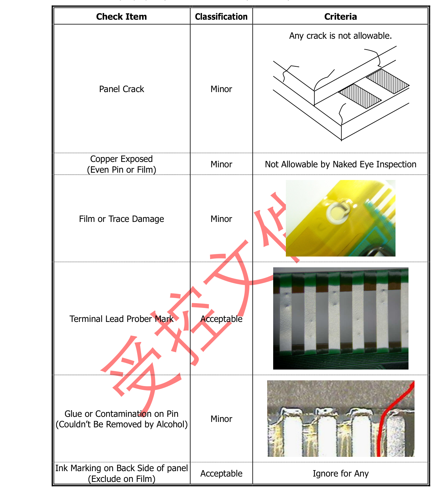

#### 6.3.1 Cosmetic Check (Display Off) in Non-Active Area (Continued) 

<!-- Start of picture text -->
Check Item  Classification Criteria Any crack is not allowable. Panel Crack  Minor Copper Exposed Minor  Not Allowable by Naked Eye Inspection (Even Pin or Film) Film or Trace Damage  Minor Terminal Lead Prober Mark  Acceptable Glue or Contamination on Pin Minor (Couldn’t Be Removed by Alcohol) Ink Marking on Back Side of panel Acceptable  Ignore for Any (Exclude on Film) <!-- End of picture text -->

