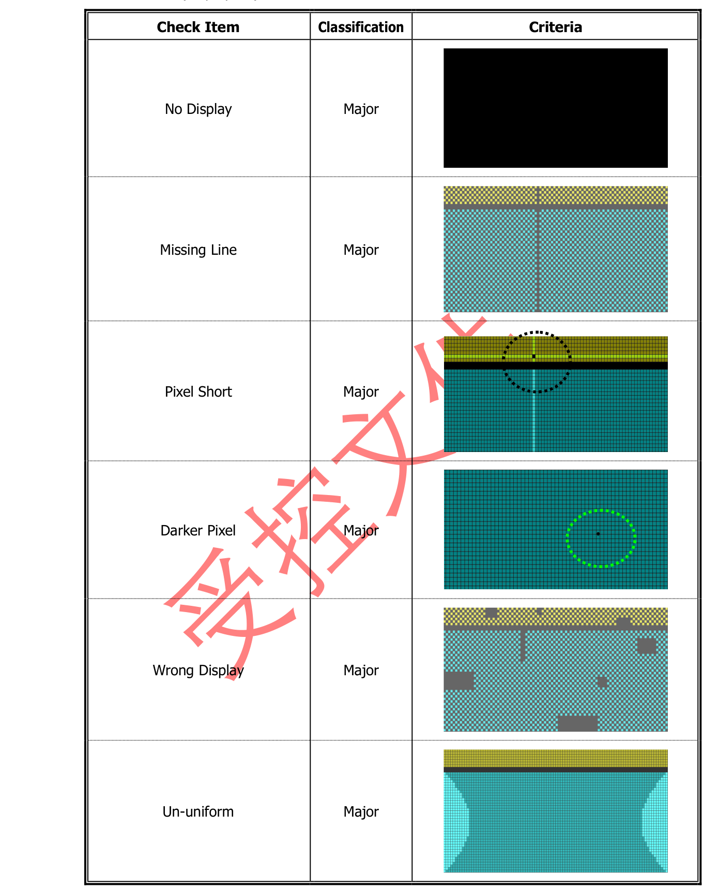

#### 6.3.3 Pattern Check (Display On) in Active Area 

<!-- Start of picture text -->
Check Item  Classification Criteria No Display  Major Missing Line  Major Pixel Short  Major Darker Pixel  Major Wrong Display  Major Un-uniform  Major <!-- End of picture text -->

