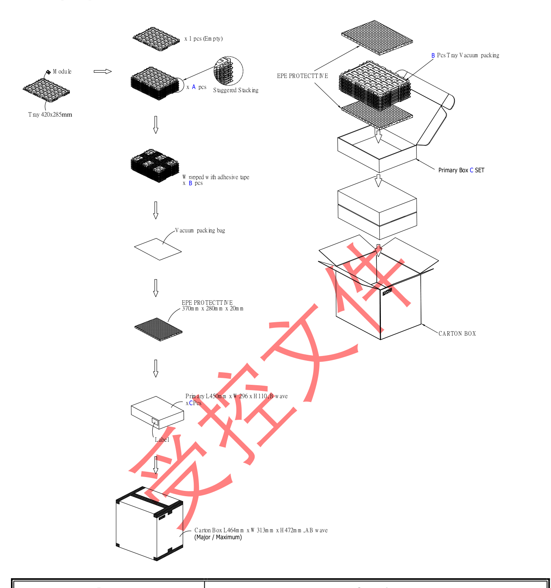

### **7. Package Specifications** 

<!-- Start of picture text -->
EPE CO V ER FO A M 351x212x1, A N TISTA TIC x 1 Pcs x 1 pcs (Em pty) 16 Pcs Tray V acuum packing B M odule EPE PRO TECTTIV E x 15 pcs A Staggered Stacking Tray 420x285 T=0.8m mmm Exsiccator x 2 pcs Brim ary Box 4 SET Primary Box C SET W rapped w ith adhesive tape x  16  B pcs V acuum packing bag EPE PRO TECTTIV E 370m m x 280m m x 20m m CA RTO N BO X Label Prim ary L450m m x W 296 x H 110, B w ave x 4Pcs C U nivision Technology Inc. Part ID : Label Lot ID : Q 'ty : Q C : Carton Box L464m m x W 313m m x H 472m m , A B w ave (Major / Maximum) <!-- End of picture text -->

## Structured tables

- [Table 1](../tables/page-36-table-1.yaml)
