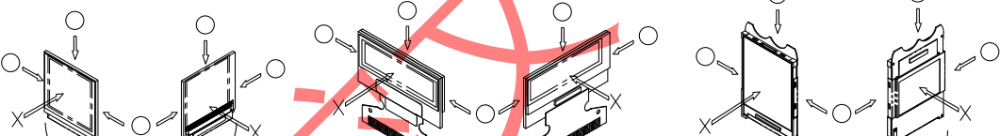

### **8. Precautions When Using These OEL Display Modules** 

#### **8.1 Handling Precautions** 

- 1) Since the display panel is being made of glass, do not apply mechanical impacts such us dropping from a high position. 

- 2) If the display panel is broken by some accident and the internal organic substance leaks out, be careful not to inhale nor lick the organic substance. 

- 3) If pressure is applied to the display surface or its neighborhood of the OEL display module, the cell structure may be damaged and be careful not to apply pressure to these sections. 

- 4) The polarizer covering the surface of the OEL display module is soft and easily scratched.  Please be careful when handling the OEL display module. 

- 5) When the surface of the polarizer of the OEL display module has soil, clean the surface.  It takes advantage of by using following adhesion tape. 

   - Scotch Mending Tape No. 810 or an equivalent 

Never try to breathe upon the soiled surface nor wipe the surface using cloth containing solvent such as ethyl alcohol, since the surface of the polarizer will become cloudy. Also, pay attention that the following liquid and solvent may spoil the polarizer: 

   - Water 

   - Ketone 

   - Aromatic Solvents 

- 6) Hold OEL display module very carefully when placing OEL display module into the system housing. Do not apply excessive stress or pressure to OEL display module.  And, do not over bend the film with electrode pattern layouts.  These stresses will influence the display performance.  Also, secure sufficient rigidity for the outer cases. 

- 7) Do not apply stress to the driver IC and the surrounding molded sections. 

- 8) Do not disassemble nor modify the OEL display module. 

- 9) Do not apply input signals while the logic power is off. 

- 10) Pay sufficient attention to the working environments when handing OEL display modules to prevent occurrence of element breakage accidents by static electricity. 

   - Be sure to make human body grounding when handling OEL display modules. 

   - Be sure to ground tools to use or assembly such as soldering irons. 

   - To suppress generation of static electricity, avoid carrying out assembly work under dry environments. 

   - Protective film is being applied to the surface of the display panel of the OEL display module.  Be careful since static electricity may be generated when exfoliating the protective film. 

- 11) Protection film is being applied to the surface of the display panel and removes the protection film before assembling it.  At this time, if the OEL display module has been stored for a long period of time, residue adhesive material of the protection film may remain on the surface of the display panel after removed of the film.  In such case, remove the residue material by the method introduced in the above Section 5). 

- 12) If electric current is applied when the OEL display module is being dewed or when it is placed under high humidity environments, the electrodes may be corroded and be careful to avoid the above. 

