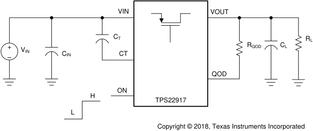

## **TPS22917x 1 V–5.5-V, 2-A, 80-mΩ Ultra-Low Leakage Load Switch** 

#### **1 Features** 

- Input operating voltage range (VIN): 1 V to 5.5 V 

- Maximum continuous current (IMAX): 2 A 

- On-resistance (RON): 

   - 5 VIN = 80 mΩ (typical) 

      - 1.8 VIN = 120 mΩ (typical) 

   - 

   - 1 VIN = 220 mΩ (typical) 

- Ultra-low power consumption: 

   - ON state (IQ): 0.5 µA (typical) 

   - OFF state (ISD): 10 nA (typical) 

- Smart ON pin pulldown (RPD): 

   - ON ≥ VIH (ION): 10 nA (maximum) 

   - ON ≤ VIL (RPD): 750 kΩ (typical) 

- Adjustable turn ON limits inrush current (tON): 

   - 5-V tON = 100 μs at 72 mV/μs (CT = open) 

- 5-V tON = 4000 μs at 2.3 mV/μs (CT = 1000 pF) 

- • Adjustable output discharge and fall time: 

- Optional QOD resistance ≥ 150 Ω (internal) 

- • Always-ON true Reverse Current Blocking (RCB): – Activation current (IRCB): –500 mA (typical) 

   - Reverse leakage (IIN,RCB): –1 µA (maximum) 

#### **2 Applications** 

- Industrial systems 

- Set top box 

- Blood glucose meters 

- Electronic point of sale 

#### **3 Description** 

The TPS22917x device is a small, single channel load switch using a low leakage P-Channel MOSFET for minimum power loss. Advanced gate control design supports operating voltages as low as 1 V with minimal increase in ON-Resistance and power loss. 

The Rise and Fall times can be independently adjusted with external components for system level optimizations. The timing capacitor (CT) and turn on time can be adjusted to manage inrush current without adding unnecessary system delays. The output discharge resistance (QOD) can be used to adjust the output fall time. Connect the QOD pin directly to the output for a fastest fall time or leave it open for the slowest fall time. 

The switch ON state is controlled by a digital input that can interface directly with low-voltage control signals. The TPS22917 uses active high enable logic, while the TPS22917L uses active low. When power is first applied, a Smart Pulldown is used to keep the ON pin from floating until system sequencing is complete. After the ON pin is deliberately driven high (≥VIH), the Smart Pulldown (RPD) is disconnected to prevent unnecessary power loss. 

The TPS22917x device is available in a leaded SOT-23 package (DBV) which allows visual inspection of solder joints. The device is characterized for operation over a temperature range of –40°C to 125°C. 

###### **Device Information**(1) 

- (1) For all available packages, see the orderable addendum at the end of the data sheet. 

<!-- Start of picture text -->
VIN VOUT +± VIN CIN CTCT RQOD CL RL QOD ON H TPS22917 L Copyright © 2018, Texas Instruments Incorporated <!-- End of picture text -->

###### **Simplified Schematic**

## Structured tables

- [125°C. Device Information(1)](../tables/page-01-125-c-device-information-1.yaml)
