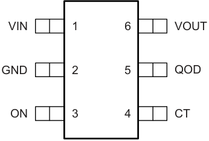

#### **6 Pin Configuration and Functions** 

<!-- Start of picture text -->
VIN 1 6 VOUT GND 2 5 QOD ON 3 4 CT <!-- End of picture text -->

**Figure 6-1. DBV Package 6-Pin SOT-23 Top View** 

**Table 6-1. Pin Functions**

## Structured tables

- [Figure 6-1. DBV Package 6-Pin SOT-23 Top View Table 6-1. Pin Functions](../tables/page-04-figure-6-1-dbv-package-6-pin-sot-23-top-view-table-6-1-pin-functions.yaml)
