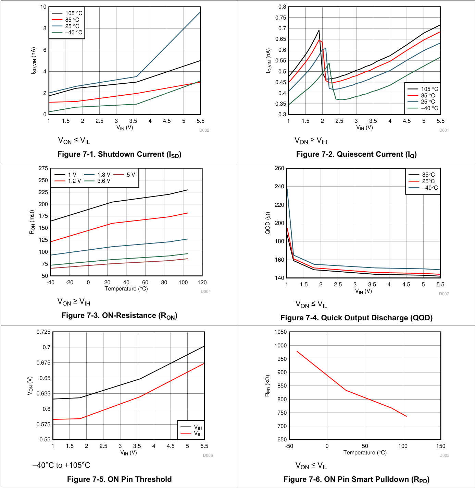

##### **7.7 Typical Characteristics** 

###### **7.7.1 Typical Electrical Characteristics** 

The typical characteristics curves in this section apply at 25°C unless otherwise noted. 

<!-- Start of picture text -->
10 0.8 105 qC 85 qC 0.75 8 25 �40 qCqC 0.7 0.65 6 0.6 0.55 4 0.5 0.45 105 qC 2 0.4 85 qC 0.35 25 �40 qCqC 0 0.3 1 1.5 2 2.5 3 3.5 4 4.5 5 5.5 1 1.5 2 2.5 3 3.5 4 4.5 5 5.5 VIN (V) D002 VIN (V) D001 VON ≤ VIL VON ≥ VIH Figure 7-1. Shutdown Current (ISD) Figure 7-2. Quiescent Current (IQ) 275 260 1 V 1.8 V 5 V 85qC 250 1.2 V 3.6 V 25qC 240 � 40 q C 225 200 220 175 200 150 125 180 100 160 75 50 140 -40 -20 0 20 40 60 80 100 120 1 1.5 2 2.5 3 3.5 4 4.5 5 5.5 Temperature (°C) D004 VIN (V) D007 VON ≥ VIH VON ≤ VIL Figure 7-3. ON-Resistance (RON) Figure 7-4. Quick Output Discharge (QOD) 0.725 1050 0.7 1000 950 0.675 900 0.65 850 0.625 800 0.6 750 0.575 VIH 700 VIL 0.55 650 1 1.5 2 2.5 3 3.5 4 4.5 5 5.5 -50 0 50 100 150 VIN (V) D006 Temperature (qC) D005 –40°C to +105°C VON ≤ VIL Figure 7-5. ON Pin Threshold Figure 7-6. ON Pin Smart Pulldown (RPD)  (nA)  (nA) ISD,VIN IQ,VIN ) (m: ): ON R QOD (  (V) ) (k: VON RPD <!-- End of picture text -->

