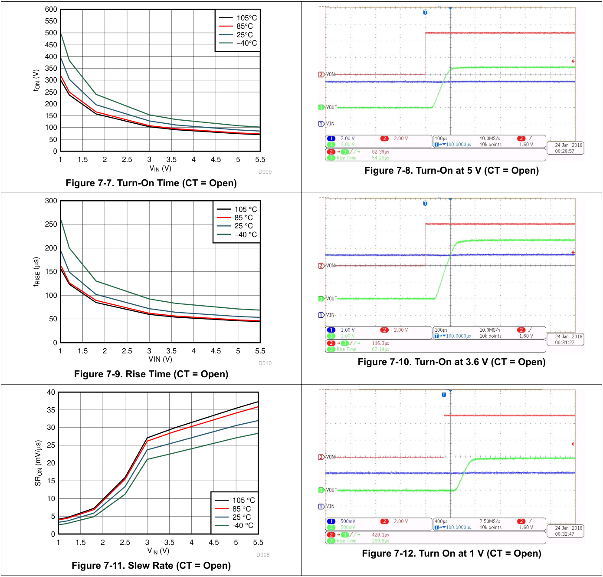

###### **7.7.2 Typical Switching Characteristics** 

The typical data in this section apply at 25°C with a load of CL = 1 μF, RL = 10 Ω, and QOD shorted to VOUT unless otherwise noted. 

<!-- Start of picture text -->
600 550 105°C 85°C 500 25°C 450 �40 ° C 400 350 300 250 200 150 100 50 0 1 1.5 2 2.5 3 3.5 4 4.5 5 5.5 VIN (V) D009 Figure 7-8. Turn-On at 5 V (CT = Open) Figure 7-7. Turn-On Time (CT = Open) 300 105 °C 85 °C 250 25 °C �40 °C 200 150 100 50 0 1 1.5 2 2.5 3 3.5 4 4.5 5 5.5 VIN (V) D010 Figure 7-10. Turn-On at 3.6 V (CT = Open) Figure 7-9. Rise Time (CT = Open) 40 35 30 25 20 15 10 105  q C 85 qC 5 25 qC -40 qC 0 1 1.5 2 2.5 3 3.5 4 4.5 5 5.5 VIN (V) D008 Figure 7-12. Turn On at 1 V (CT = Open) Figure 7-11. Slew Rate (CT = Open)  (V) tON s) P  ( tRISE s) P  (mV/ ON SR <!-- End of picture text -->

