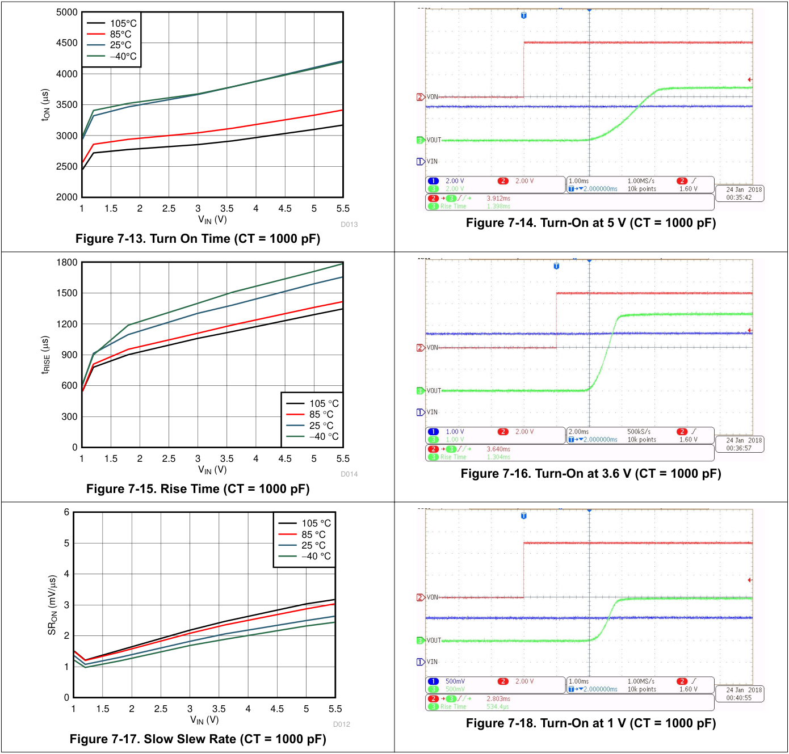

###### **7.7.2 Typical Switching Characteristics (continued)** 

<!-- Start of picture text -->
5000 105°C 85°C 4500 25°C �40°C 4000 3500 3000 2500 2000 1 1.5 2 2.5 3 3.5 4 4.5 5 5.5 VIN (V) D013 Figure 7-14. Turn-On at 5 V (CT = 1000 pF) Figure 7-13. Turn On Time (CT = 1000 pF) 1800 1500 1200 900 600 105 qC 300 85  q C 25 qC �40 qC 0 1 1.5 2 2.5 3 3.5 4 4.5 5 5.5 VIN (V) D014 Figure 7-16. Turn-On at 3.6 V (CT = 1000 pF) Figure 7-15. Rise Time (CT = 1000 pF) 6 105 °C 85 °C 5 25 °C �40 °C 4 3 2 1 0 1 1.5 2 2.5 3 3.5 4 4.5 5 5.5 VIN (V) D012 Figure 7-18. Turn-On at 1 V (CT = 1000 pF) Figure 7-17. Slow Slew Rate (CT = 1000 pF) s) P  ( tON s) P  ( tRISE s) P  (mV/ ON SR <!-- End of picture text -->

