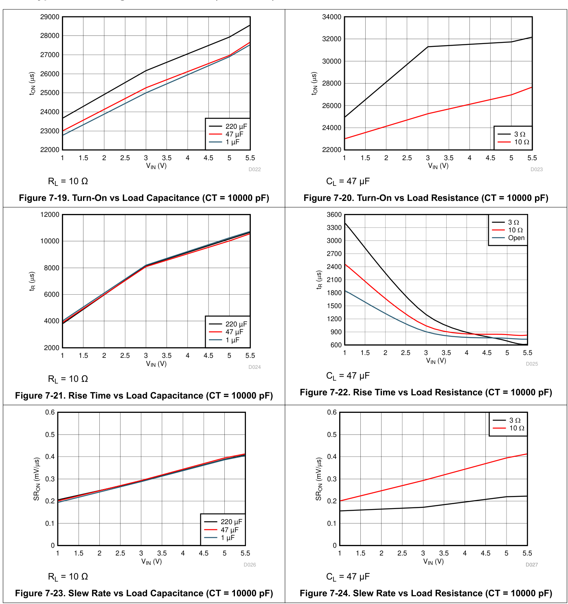

###### **7.7.2 Typical Switching Characteristics (continued)** 

<!-- Start of picture text -->
29000 34000 28000 32000 27000 30000 26000 28000 25000 26000 24000 23000 220 47 µFµF 24000 3 : 1 µF 10 : 22000 22000 1 1.5 2 2.5 3 3.5 4 4.5 5 5.5 1 1.5 2 2.5 3 3.5 4 4.5 5 5.5 VIN (V) D022 VIN (V) D023 RL = 10 Ω CL = 47 µF Figure 7-19. Turn-On vs Load Capacitance (CT = 10000 pF) Figure 7-20. Turn-On vs Load Resistance (CT = 10000 pF) 12000 3600 3 : 3300 10 : 10000 3000 Open 2700 8000 2400 2100 6000 1800 1500 4000 220 µF 1200 47 µF 900 1 µF 2000 600 1 1.5 2 2.5 3 3.5 4 4.5 5 5.5 1 1.5 2 2.5 3 3.5 4 4.5 5 5.5 VIN (V) D024 VIN (V) D025 RL = 10 Ω CL = 47 µF Figure 7-21. Rise Time vs Load Capacitance (CT = 10000 pF) Figure 7-22. Rise Time vs Load Resistance (CT = 10000 pF) 0.6 0.6 3 : 10 : 0.5 0.5 0.4 0.4 0.3 0.3 0.2 0.2 0.1 220 µF 0.1 47 µF 1 µF 0 0 1 1.5 2 2.5 3 3.5 4 4.5 5 5.5 1 1.5 2 2.5 3 3.5 4 4.5 5 5.5 VIN (V) D026 VIN (V) D027 RL = 10 Ω CL = 47 µF Figure 7-23. Slew Rate vs Load Capacitance (CT = 10000 pF) Figure 7-24. Slew Rate vs Load Resistance (CT = 10000 pF) s) s) P P  (  ( tON tON s) (tPR s) (tPR s) s) P P  (mV/  (mV/ ON ON SR SR <!-- End of picture text -->

