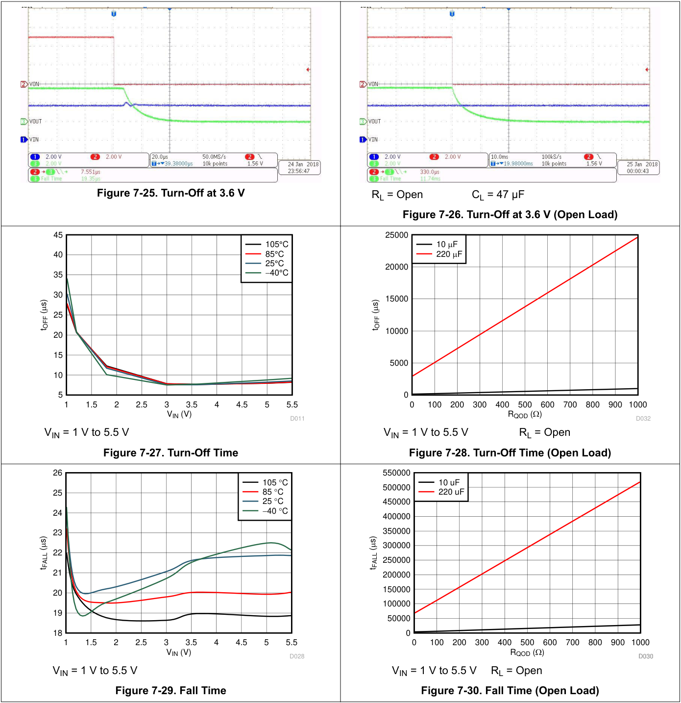

###### **7.7.2 Typical Switching Characteristics (continued)** 

<!-- Start of picture text -->
Figure 7-25. Turn-Off at 3.6 V RL = Open CL = 47 μF Figure 7-26. Turn-Off at 3.6 V (Open Load) 45 25000 105°C 10 PF 40 85°C 220 PF 35 25°C �40 ° C 20000 30 15000 25 20 10000 15 5000 10 5 0 1 1.5 2 2.5 3 3.5 4 4.5 5 5.5 0 100 200 300 400 500 600 700 800 900 1000 VIN (V) D011 RQOD (:) D032 VIN = 1 V to 5.5 V VIN = 1 V to 5.5 V RL = Open Figure 7-27. Turn-Off Time Figure 7-28. Turn-Off Time (Open Load) 26 550000 105 qC 10 uF 25 85 qC 500000 220 uF 25 qC 450000 24 �40  q C 400000 23 350000 300000 22 250000 21 200000 20 150000 100000 19 50000 18 0 1 1.5 2 2.5 3 3.5 4 4.5 5 5.5 0 100 200 300 400 500 600 700 800 900 1000 VIN (V) D028 RQOD (:) D030 VIN = 1 V to 5.5 V VIN = 1 V to 5.5 V RL = Open Figure 7-29. Fall Time Figure 7-30. Fall Time (Open Load) s) s) P P  (  ( tOFF tOFF s) s) P P  (  ( tFALL tFALL <!-- End of picture text -->

