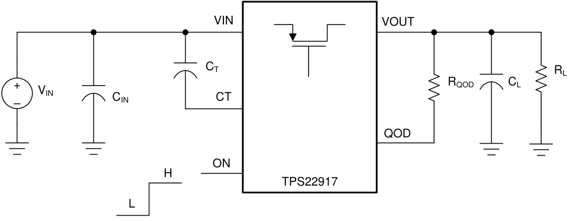
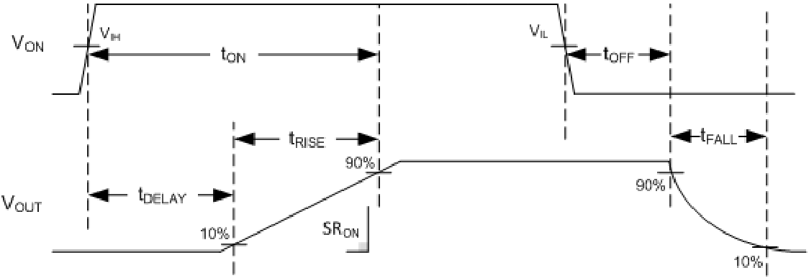

#### **8 Parameter Measurement Information** 

##### **8.1 Test Circuit and Timing Waveforms Diagrams** 

<!-- Start of picture text -->
VIN VOUT CT RL +± VIN CIN CT RQOD CL QOD ON H TPS22917 L <!-- End of picture text -->

<!-- Start of picture text -->
Copyright © 2018, Texas Instruments Incorporated <!-- End of picture text -->

- A. Rise and fall times of the control signal are 100 ns. 

- B. Turn-off times and fall times are dependent on the time constant at the load. For TPS22917x, the internal pull-down resistance QOD is enabled when the switch is disabled. The time constant is (RQOD + QOD || RL) × CL. 

**Figure 8-1. Test Circuit** 

**Figure 8-2. Timing Waveforms** 

