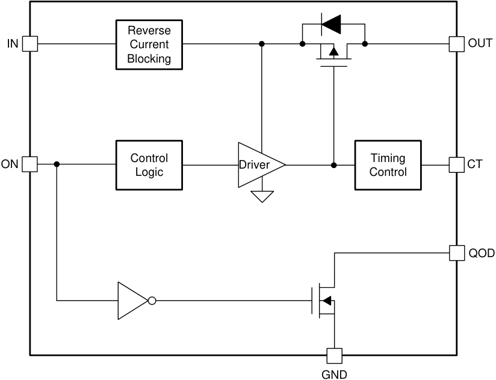

#### **9 Detailed Description** 

##### **9.1 Overview** 

The TPS22917x device is a 5.5-V, 2-A load switch in a 6-pin SOT-23 package. To reduce voltage drop for low voltage and high current rails, the device implements a low resistance P-channel MOSFET which reduces the drop out voltage across the device. 

The TPS22917x device has a configurable slew rate which helps reduce or eliminate power supply droop because of large inrush currents. Furthermore, the device features a QOD pin, which allows the configuration of the discharge rate of VOUT after the switch is disabled. During shutdown, the device has very low leakage currents, thereby reducing unnecessary leakages for downstream modules during standby. Integrated control logic, driver, charge pump, and output discharge FET eliminates the need for any external components which reduces solution size and bill of materials (BOM) count. 

##### **9.2 Functional Block Diagram** 

<!-- Start of picture text -->
Reverse IN Current OUT Blocking ON Control Driver Timing CT Logic Control QOD GND <!-- End of picture text -->

