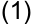

##### **9.3 Feature Description** 

###### **9.3.1 On and Off Control** 

The ON pin controls the state of the switch. The ON pin is compatible with standard GPIO logic threshold so it can be used in a wide variety of applications. The TPS22917 is enabled when the voltage applied to the ON pin is pulled above VIH, while the TPS22917L is enabled when the voltage is below VIL. 

When power is first applied to VIN, a Smart Pulldown is used to keep the ON pin from floating until system sequencing is complete. After the ON pin is deliberately driven high (≥VIH), the Smart Pulldown is disconnected to prevent unnecessary power loss. Table 9-1 shown then the ON Pin Smart Pulldown is active. 

**Table 9-1. Smart-ON Pulldown** 

###### **9.3.2 Turn-On Time (tON) and Adjustable Slew Rate (CT)** 

A capacitor to VIN on the CT pin sets the slew rate of VOUT. The CT capacitor voltage ramps until shortly after the switch is turned on and VOUT becomes stable. 

Leaving the CT pin open results in the highest slew rate and fastest turn-on time. These values can be found in the Switching Characteristics Table. For slower slew rates the required CT capacitor can be found using Equation 1: 

CT = (Slew Rate) ÷ SRON 

###### where 

- Slew Rate = desired slew rate (mV/us) 

- CT = the capacitance value on the CT pin (pF) 

- SRON = slew rate constant from table [(mV/µs) × pF] 

The total turn-on time has a direct correlation to the output slew rate. The fastest turn on times (tON), with CT pin open, can be found in the _Switching Characteristics_ . For slower slew rates, the resulting turn-on time can be found with Equation 2: 

Turn-On time = CT × tON 

(2) 

###### where 

- Turn-On Time = total time from enable until VOUT rises to 90% of VIN (µs) 

- CT =the capacitance value on the CT pin (pF) 

- tON = Turn-On time constant (µs/pF) 

###### **9.3.3 Fall Time (tFALL) and Quick Output Discharge (QOD)** 

The TPS22917x device includes a QOD pin that can be configured in one of three ways: 

- QOD pin shorted to VOUT pin. Using this method, the discharge rate after the switch becomes disabled is controlled with the value of the internal resistance QOD. 

- QOD pin connected to VOUT pin using an external resistor RQOD. After the switch becomes disabled, the discharge rate is controlled by the value of the total discharge resistance. To adjust the total discharge resistance, Equation 3 can be used: 

RDIS = QOD + RQOD (3) 

- Where: 

- RDIS = total output discharge resistance (Ω) 

- QOD = internal pulldown resistance (Ω) 

- RQOD = external resistance placed between the VOUT and QOD pins (Ω)

## Structured tables

- [to prevent unnecessary power loss. Table 9-1 shown then the ON Pin Smart Pulldown is active. Table 9-1. Smart-ON Pulldown](../tables/page-15-to-prevent-unnecessary-power-loss-table-9-1-shown-then-the-on-pin-smart-pulldown.yaml)
