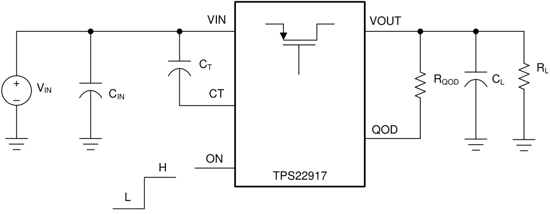

#### **10 Application and Implementation** 

###### **Note** 

Information in the following applications sections is not part of the TI component specification, and TI does not warrant its accuracy or completeness. TI’s customers are responsible for determining suitability of components for their purposes, as well as validating and testing their design implementation to confirm system functionality. 

##### **10.1 Application Information** 

This section highlights some of the design considerations when implementing this device in various applications. 

##### **10.2 Typical Application** 

This typical application demonstrates how the TPS22917x device can be used to power downstream modules. 

<!-- Start of picture text -->
VIN VOUT CT RL +± VIN CIN CT RQOD CL QOD ON H TPS22917 L <!-- End of picture text -->

<!-- Start of picture text -->
Copyright © 2018, Texas Instruments Incorporated <!-- End of picture text -->

**Figure 10-1. Typical Application Schematic** 

###### **10.2.1 Design Requirements** 

For this design example, use the values listed in Table 10-1 as the design parameters: 

**Table 10-1. Design Parameters**

## Structured tables

- [For this design example, use the values listed in Table 10-1 as the design parameters: Table 10-1. Design Parameters](../tables/page-17-for-this-design-example-use-the-values-listed-in-table-10-1-as-the-design-parame.yaml)
