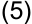
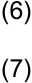
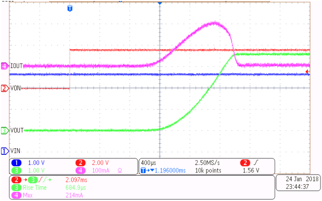
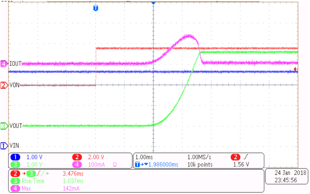
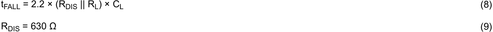
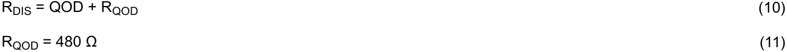

###### **10.2.2 Detailed Design Procedure** 

###### **_10.2.2.1 Limiting Inrush Current_** 

Use Equation 5 to find the maximum slew rate value to limit inrush current for a given capacitance: 

(Slew Rate) = IRUSH ÷ CL 

###### where 

- IINRUSH = maximum acceptable inrush current (mA) 

- CL = capacitance on VOUT (μF) 

- Slew Rate = Output Slew Rate during turn on (mV/μs) 

After the required slew rate shown in Equation 1 can be used to find the minimum CT capacitance 

CT = SRON ÷ (Slew Rate) 

CT = 1900 ÷ 3.2 = 594 pF 

To ensure an inrush current of less than 150 mA, choose a CT value greater than 594 pF. An appropriate value must be placed on such that the IMAX and IPLS specifications of the device are not violated. 

###### **_10.2.2.2 Application Curves_** 

**Figure 10-2. Inrush Current (CT = 470 pF)** 

**Figure 10-3. Inrush Current (CT = 1000 pF)** 

###### **_10.2.2.3 Setting Fall Time for Shutdown Power Sequencing_** 

Microcontrollers and processors often have a specific shutdown sequence in which power must be removed. Using the adjustable Quick Output Discharge function of the TPS22917x, adding a load switch to each power rail can be used to manage the power down sequencing. To determine the QOD values for each load switch, first confirm the power down order of the device you wish to power sequence. Be sure to check if there are voltage or timing margins that must be maintained during power down. 

After the required fall time is determined, the maximum external discharge resistance (RDIS) value can be found using Equation 4: 

Equation 3 can then be used to calculate the RQOD resistance needed to acheive a particular discharge value: 

