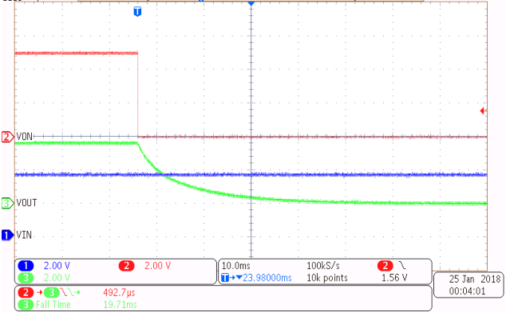
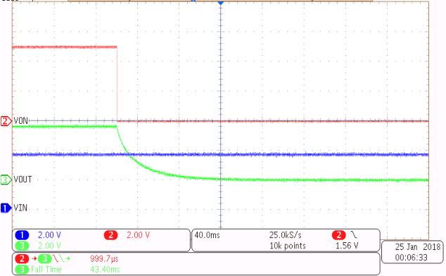

To ensure a fall time greater than, choose an RQOD value greater than 480 Ω. 

###### **_10.2.2.4 Application Curves_** 

#### **11 Power Supply Recommendations** 

The device is designed to operate with a VIN range of 1 V to 5.5 V. The VIN power supply must be well regulated and placed as close to the device terminal as possible. The power supply must be able to withstand all transient load current steps. In most situations, using an input capacitance (CIN) of 1 μF is sufficient to prevent the supply voltage from dipping when the switch is turned on. In cases where the power supply is slow to respond to a large transient current or large load current step, additional bulk capacitance can be required on the input. 

