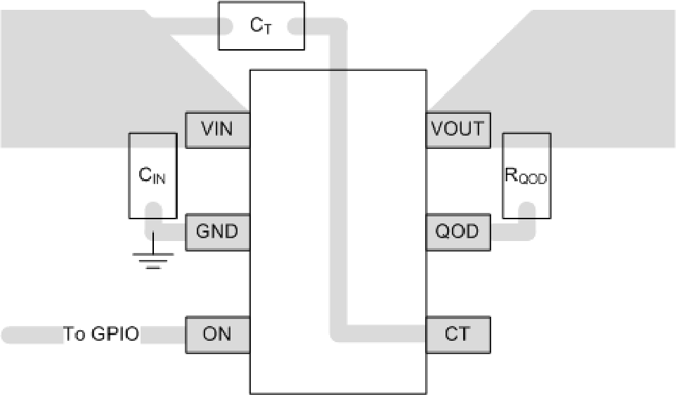
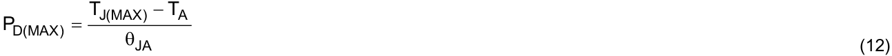

#### **12 Layout** 

##### **12.1 Layout Guidelines** 

For best performance, all traces must be as short as possible. To be most effective, the input and output capacitors must be placed close to the device to minimize the effects that parasitic trace inductances can have on normal operation. Using wide traces for VIN, VOUT, and GND helps minimize the parasitic electrical effects. 

##### **12.2 Layout Example** 

**Figure 12-1. Recommended Board Layout** 

##### **12.3 Thermal Considerations** 

The maximum IC junction temperature must be restricted to 125°C under normal operating conditions. To calculate the maximum allowable dissipation, PD(max) for a given output current and ambient temperature, use Equation 12: 

where 

- PD(MAX) = maximum allowable power dissipation 

- TJ(MAX) = maximum allowable junction temperature (125°C for the TPS22917x) 

- TA = ambient temperature of the device 

- θJA = junction to air thermal impedance. Refer to the _Thermal Information_ section. This parameter is highly dependent upon board layout. 

