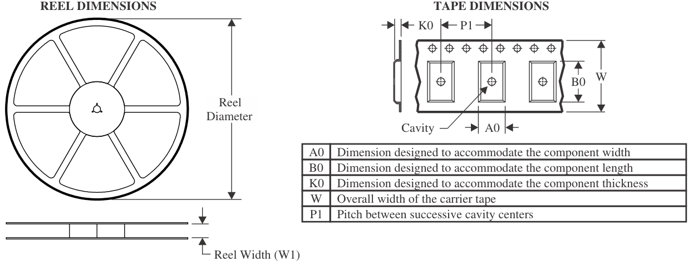
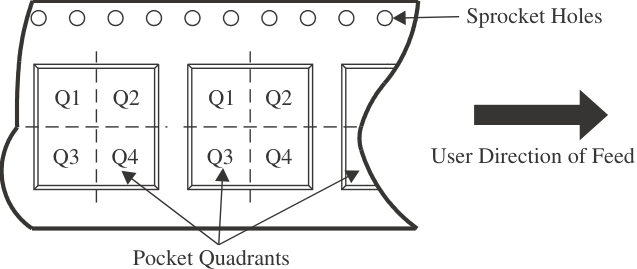

### **PACKAGE MATERIALS INFORMATION** 

##### **TAPE AND REEL INFORMATION** 

<!-- Start of picture text -->
REEL DIMENSIONS TAPE DIMENSIONS K0  P1 W B0 Reel Diameter Cavity A0 A0 Dimension designed to accommodate the component width B0 Dimension designed to accommodate the component length K0 Dimension designed to accommodate the component thickness W Overall width of the carrier tape P1 Pitch between successive cavity centers Reel Width (W1) <!-- End of picture text -->

###### **QUADRANT ASSIGNMENTS FOR PIN 1 ORIENTATION IN TAPE** 

<!-- Start of picture text -->
Sprocket Holes Q1 Q2 Q1 Q2 Q3 Q4 Q3 Q4 User Direction of Feed Pocket Quadrants <!-- End of picture text -->

*All dimensions are nominal

## Structured tables

- [*All dimensions are nominal](../tables/page-24-all-dimensions-are-nominal.yaml)
