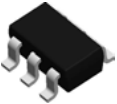
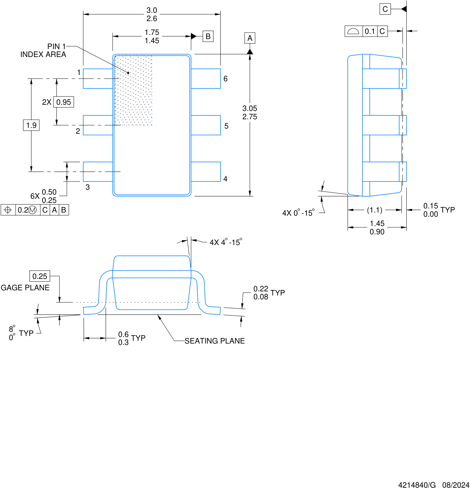

## **PACKAGE OUTLINE** 

###### SMALL OUTLINE TRANSISTOR 

<!-- Start of picture text -->
3.0 C 2.6 1.75 0.1 C 1.45 B A PIN 1 INDEX AREA 1 6 2X 0.95 3.05 2.75 1.9 5 2 4 3 6X  0.50 0.25 0.15 0.2 C A B 4X 0 -15 (1.1) 0.00  TYP 1.45 0.90 4X 4 -15 0.25 GAGE PLANE 0.22 0.08  TYP 8 0.6 0  TYP 0.3  TYP S EATING PLANE 4214840/G   08/2024 <!-- End of picture text -->

NOTES: 

1. All linear dimensions are in millimeters. Any dimensions in parenthesis are for reference only. Dimensioning and tolerancing per ASME Y14.5M. 

2. This drawing is subject to change without notice. 

3. Body dimensions do not include mold flash or protrusion. Mold flash and protrusion shall not exceed 0.25 per side. 

4. Leads 1,2,3 may be wider than leads 4,5,6 for package orientation. 

5. Refernce JEDEC MO-178. 

