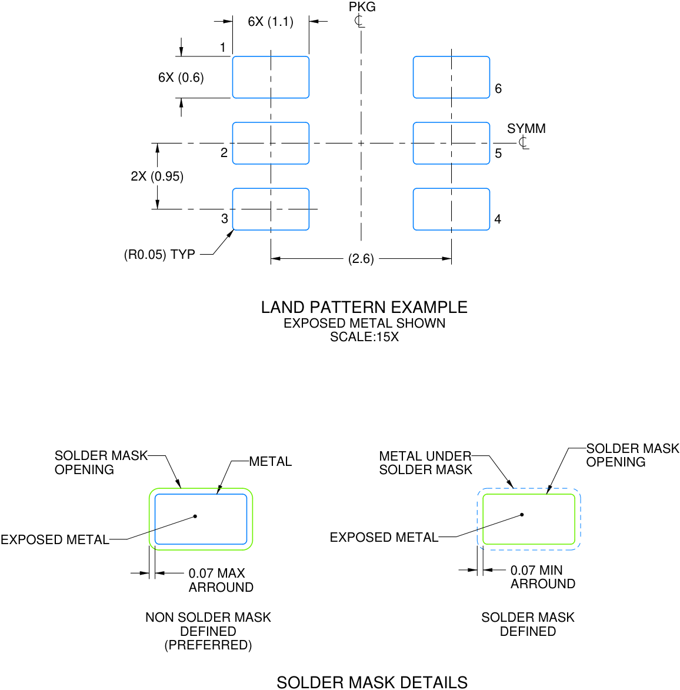
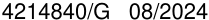

## **EXAMPLE BOARD LAYOUT** 

# **DBV0006A** 

SMALL OUTLINE TRANSISTOR 

<!-- Start of picture text -->
PKG 6X (1.1) 1 6X (0.6) 6 SYMM 2 5 2X (0.95) 3 4 (R0.05) TYP (2.6) LAND PATTERN EXAMPLE EXPOSED METAL SHOWN SCALE:15X S OLDER MASK SOLDER MASK METAL UNDER METAL OPENING OPENING SOLDER MASK EXPOSED METAL EXPOSED METAL 0.07 MAX 0.07 MIN ARROUND ARROUND NON SOLDER MASK SOLDER MASK DEFINED DEFINED (PREFERRED) SOLDER MASK DETAILS <!-- End of picture text -->

<!-- Start of picture text -->
4214840/G   08/2024 <!-- End of picture text -->

NOTES: (continued) 

6. Publication IPC-7351 may have alternate designs. 

7. Solder mask tolerances between and around signal pads can vary based on board fabrication site. 

