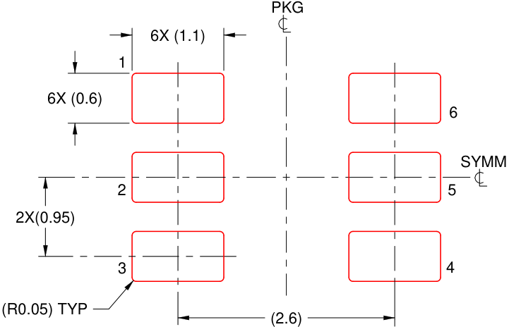

## **EXAMPLE STENCIL DESIGN** 

# **DBV0006A** 

SMALL OUTLINE TRANSISTOR 

<!-- Start of picture text -->
PKG 6X (1.1) 1 6X (0.6) 6 SYMM 2 5 2X(0.95) 3 4 (R0.05) TYP (2.6) <!-- End of picture text -->

SOLDER PASTE EXAMPLE BASED ON 0.125 mm THICK STENCIL SCALE:15X 

4214840/G   08/2024 

NOTES: (continued) 

8. Laser cutting apertures with trapezoidal walls and rounded corners may offer better paste release. IPC-7525 may have alternate design recommendations. 

9. Board assembly site may have different recommendations for stencil design. 

