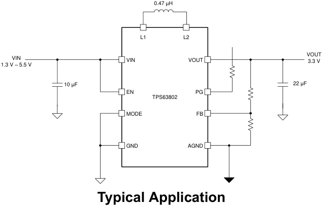
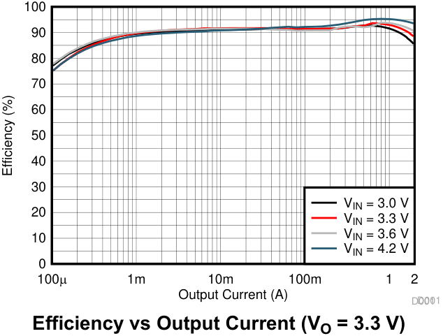

# **TPS63802 2-A, High-efficient, Low IQ Buck-boost Converter in DFN Package** 

### **1 Features** 

- Input voltage range: 1.3 V to 5.5 V 

   - Device input voltage > 1.8 V for start-up 

- Output voltage range: 1.8 V to 5.2 V (adjustable) 

- 2-A output current for VI ≥ 2.3 V, VO = 3.3 V 

- High efficiency over the entire load range – 11-µA operating quiescent current 

- – Power save mode and mode selection for forced PWM-mode 

- Peak current buck-boost mode architecture 

   - Defined transition points between buck, buckboost, and boost operation modes 

   - Forward and reverse current operation 

   - Start-up into pre-biased outputs 

- Safety and robust operation features – Integrated soft start 

   - Overtemperature- and overvoltage-protection 

   - True shutdown function with load disconnect 

   - Forward and backward current limit 

- Small solution size of 21.5 mm2 

   - Tiny SON/DFN package (similar to QFN) 

   - Small 0.47-µH inductor 

   - Works with a 22-µF minimum output capacitor 

- Create a custom design using the TPS63802 with the WEBENCH® Power Designer 

### **2 Applications** 

- System pre-regulator (tracking and telematics, portable POS, home automation, IP network camera) 

- Point-of-load regulation (wired sensor, port/cable adapter and dongle, electronic smart lock, IoT) 

- Battery back-up supply (electricity meter, data concentrator, power quality meter) 

- Thermoelectric device supply (TEC, optical modules) 

- General purpose voltage stabilizer and converter 

### **3 Description** 

The TPS63802 is a high efficiency, high output current buck-boost converter. Depending on the input voltage, it automatically operates in boost, buck, or in a novel 4-cycle buck-boost mode when the input voltage is approximately equal to the output voltage. The transitions between modes happen at defined thresholds and avoid unwanted toggling within the modes to reduce output voltage ripple. The device output voltages are individually set by a resistive divider within a wide output voltage range. An 11-μA quiescent current enables the highest efficiency for little to no-load conditions. 

##### **Device Information** 

- (1) For all available packages, see the orderable addendum at the end of the datasheet. 

<!-- Start of picture text -->
0.47 µH L1 L2 1.3 V VIN± 5.5 V VIN VOUT VOUT3.3 V 10 �F 22 �F EN PG TPS63802 MODE FB GND AGND Typical Application <!-- End of picture text -->

<!-- Start of picture text -->
100 90 80 70 60 50 40 30 20 V VININ  = 3.0 V = 3.3 V 10 V IN  = 3.6 V VIN = 4.2 V 0 100P 1m 10m 100m 1 2 Output Current (A) D0D 0 101 Efficiency vs Output Current (VO = 3.3 V) Efficiency (%) <!-- End of picture text -->

## Structured tables

- [little to no-load conditions. Device Information](../tables/page-01-little-to-no-load-conditions-device-information.yaml)
