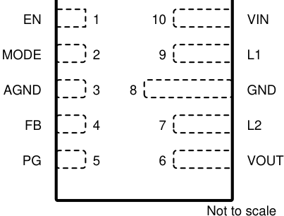

### **7 Pin Configuration and Functions** 

<!-- Start of picture text -->
EN 1 10 VIN MODE 2 9 L1 AGND 3 8 GND FB 4 7 L2 PG 5 6 VOUT Not to scale <!-- End of picture text -->

**Figure 7-1. 10-Pin DLA Package (Top View)** 

**Table 7-1. Pin Functions**

## Structured tables

- [Figure 7-1. 10-Pin DLA Package (Top View) Table 7-1. Pin Functions](../tables/page-04-figure-7-1-10-pin-dla-package-top-view-table-7-1-pin-functions.yaml)
