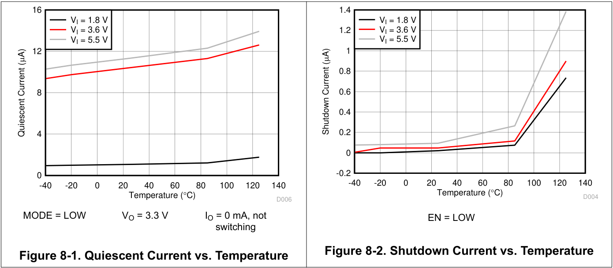

#### **8.6 Typical Characteristics** 

<!-- Start of picture text -->
16 1.4 VI = 1.8 V VI = 1.8 V VI = 3.6 V 1.2 VI = 3.6 V VI = 5.5 V VI = 5.5 V 12 1 0.8 8 0.6 0.4 4 0.2 0 0 -0.2 -40 -20 0 20 40 60 80 100 120 140 -40 -20 0 20 40 60 80 100 120 140 Temperature (qC) D006 Temperature (qC) D004 MODE = LOW VO = 3.3 V IO = 0 mA, not EN = LOW switching Figure 8-2. Shutdown Current vs. Temperature Figure 8-1. Quiescent Current vs. Temperature A) A) P P Quiescent Current ( Shutdown Current ( <!-- End of picture text -->

