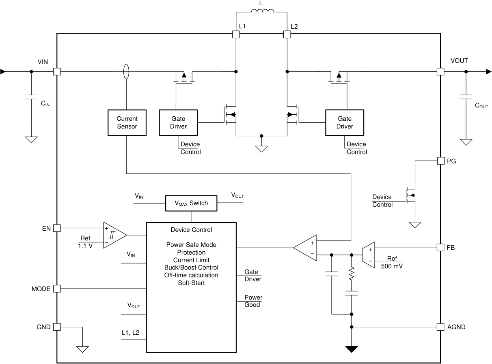

### **9 Detailed Description** 

#### **9.1 Overview** 

The TPS63802 buck-boost converter uses four internal switches to maintain synchronous power conversion at all possible operating conditions. This enables the device to keep high efficiency over a wide input voltage and output load range. To regulate the output voltage at all possible input voltage conditions, the device automatically transitions between buck, buck-boost, and boost operation as required by the operating conditions. Therefore, it operates as a buck converter when the input voltage is higher than the output voltage, and as a boost converter when the input voltage is lower than the output voltage. When the input voltage is close to the output voltage, it operates in a 3-cycle buck-boost operation. In this mode, all four switches are active (see _Section 9.4.1.3_ ). The RMS current through the switches and the inductor is kept at a minimum to minimize switching and conduction losses. Controlling the switches this way allows the converter to always keep high efficiency over the complete input voltage range. The device provides a seamless transition between all modes. 

#### **9.2 Functional Block Diagram** 

<!-- Start of picture text -->
L L1 L2 VIN VOUT CIN COUT Current Gate Gate Sensor Driver Driver Device Device Control Control PG VIN VOUT Device VMAX Switch Control EN + Device Control 1.1 VRef ± VIN Power Safe ModeCurrent LimitProtection +± ±+ Ref FB Buck/Boost Control 500 mV Off-time calculation Gate Soft-Start Driver MODE Power VOUT Good GND AGND L1, L2 <!-- End of picture text -->

