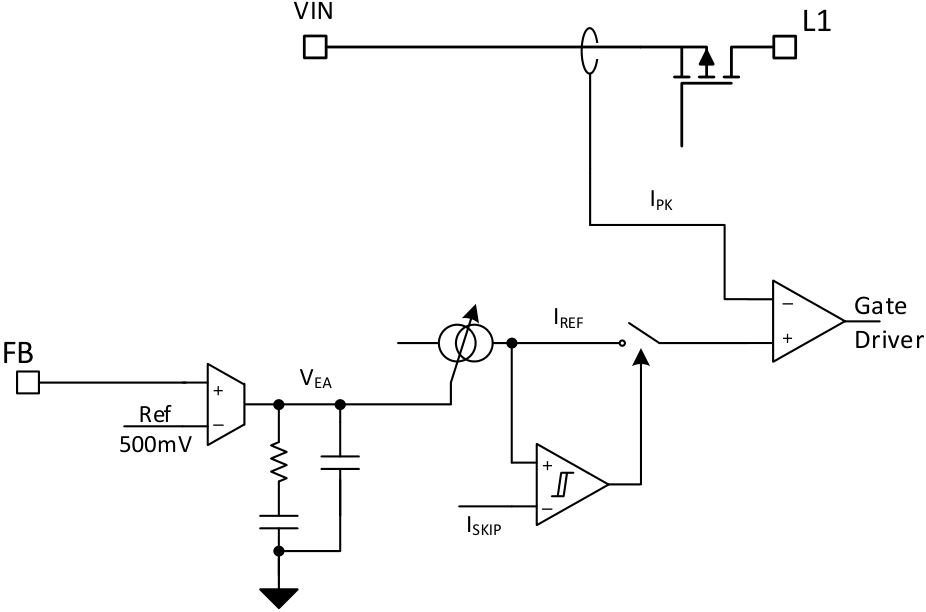
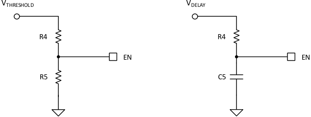

#### **9.3 Feature Description** 

##### **9.3.1 Control Loop Description** 

The TPS63802 uses a peak current mode control architecture. It has an inner current loop where it measures the peak current of the boost high-side MOSFET and compares it to a reference current. This current is the output of the outer voltage loop. It measures the output voltage via the FB-pin and compares it with the internal voltage reference. That means, the outer voltage loop measures the voltage error (VREF-VFB), and transforms it into the system current demand (IREF) for the inner current loop. 

Figure 9-1 shows the simplified schematic of the control loop. The error amplifier and the type-2 compensation represent the voltage loop. The voltage output is converted into the reference current IREF and fed into the current comparator. 

The scheme shows the skip-comparator handling the power-save mode (PFM) to achieve high efficiency at light loads. See _Section 9.4.2_ for further details. 

<!-- Start of picture text -->
VIN L1 IPK Gate IREF Driver FB + VEA Ref ± 500mV + ISKIP ± ± + <!-- End of picture text -->

**Figure 9-1. Control Loop Architecture Scheme** 

##### **9.3.2 Precise Device Enable: Threshold- or Delayed Enable** 

The enable-pin is a digital input to enable or disable the device by applying a high or low level. The device enters shutdown when EN is set low. In addition, this input features a precise threshold and can be used as a comparator that enables and disables the part at a defined threshold. This allows you to drive the state by a slowly changing voltage and enables the use of an external RC network to achieve a precise power-up delay. The enable pin can also be used with an external voltage divider to set a user-defined minimum supply voltage. For proper operation, the EN pin must be terminated and must not be left floating. 

<!-- Start of picture text -->
VTHRESHOLD VDELAY R4  R4 EN EN R5  C5 <!-- End of picture text -->

**Figure 9-2. Circuit Example for How to Use the Precise Device Enable Feature** 

