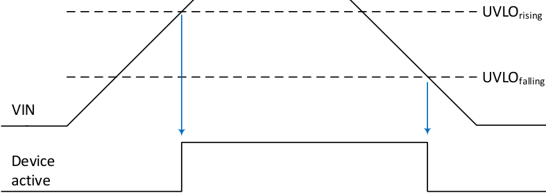

##### **9.3.3 Mode Selection (PFM/PWM)** 

The mode-pin is a digital input to enable the automatic PWM/PFM mode that features the highest efficiency by allowing pulse-frequency-modulation for lower output currents. This mode is enabled by applying a low level. The device can be forced in PWM operation regardless of the output current to achieve minimum output ripple by applying a high level. This pin must not be left floating. 

##### **9.3.4 Undervoltage Lockout (UVLO)** 

To avoid mis-operation of the device at low input voltages, an undervoltage lockout is included. It activates the device once the input voltage (VI) has increased the UVLOrising value. Once active, the device allows operation down to even smaller input voltages, which is determined by the UVLOfalling. This behavior requires VO to be higher than the minimum value of 1.8 V. 

<!-- Start of picture text -->
UVLOrising UVLOfalling VIN Device active <!-- End of picture text -->

**Figure 9-3. Rising and Falling Undervoltage Lockout Behavior** 

##### **9.3.5 Soft Start** 

To minimize inrush current and output voltage overshoot during start-up, the device features a controlled soft start-up. After the device is enabled, the device starts all internal reference and control circuits within the enable delay time, Tdelay. After that, the maximum switch current limit rises monotonically from 0 mA to the current limit. The loop stops switching once VO is reached. This allows a quick output voltage ramp for small capacitors at the output. The bigger the output capacitor, the longer it takes to settle Vo. A potential load during start-up will lengthen the duration of the output voltage ramp as well. The gradual ramp of the current limit allows a small inrush current for no-load conditions, as well as the possibility to start into high loads at start-up. 

The converter can start-up into pre-biased loads by a forced operation in PFM during the soft-start until the first switching cycle request from the output voltage control loop. 

