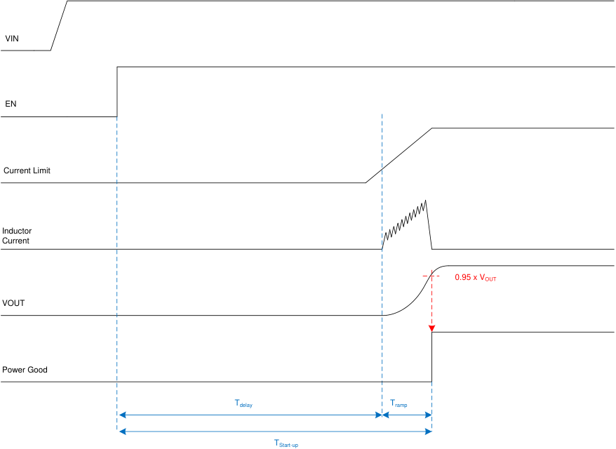

<!-- Start of picture text -->
VIN EN Current Limit Inductor Current 0.95 x VOUT VOUT Power Good Tdelay Tramp TStart-up <!-- End of picture text -->

**Figure 9-4. Device Start-up Scheme** 

##### **9.3.6 Adjustable Output Voltage** 

The device's output voltage is adjusted by applying an external resistive divider between VO, the FB-pin, and GND. This allows you to program the output voltage in the recommended range. The divider must provide a lowside resistor of less than 100 kΩ. The high-side resistor is chosen accordingly. 

##### **9.3.7 Overtemperature Protection - Thermal Shutdown** 

The device has a built-in temperature sensor which monitors the junction temperature. If the temperature exceeds the threshold, the device stops operating. As soon as the IC temperature has decreased below the programmed threshold, it starts operating again. There is a built-in hysteresis to avoid unstable operation at junction temperatures at the overtemperature threshold. 

##### **9.3.8 Input Overvoltage - Reverse-Boost Protection (IVP)** 

The TPS63802 can operate in reverse mode where the device transfers energy from the output back to the input. If the source is not able to sink the revers current, the negative current builds up a charge to the input capacitance and VIN rises. To protect the device and other components from that scenario, the device features an input voltage protection (IVP) for reverse boost operation. Once the input voltage is above the threshold, the converter forces PFM mode and the negative current operation is interrupted. 

The PG signal goes low to indicate that behavior. 

##### **9.3.9 Output Overvoltage Protection (OVP)** 

In case of a broken feedback-path connection, the device can loose VO information and is not able to regulate. To avoid an uncontrolled boosting of VO, the TPS63802 features output overvoltage protection. It measures the voltage on the VOUT pin and stops switching when VO is greater than the threshold to avoid harm to the converter and other components. 

##### **9.3.10 Power-Good Indicator** 

The power good goes high-impedance once the output is above 95% of the nominal voltage, and is driven low once the output voltage falls below typically 90% of the nominal voltage. This feature also indicates overvoltage and device shutdown cases as shown in Table 9-1. The PG pin is an open-drain output and is specified to sink up to 1 mA. The power-good output requires a pullup resistor connecting to any voltage rail less than 5.5 V. The PG signal can be used to sequence multiple rails by connecting it to the EN pin of other converters. Leave the PG pin unconnected when not used. 

