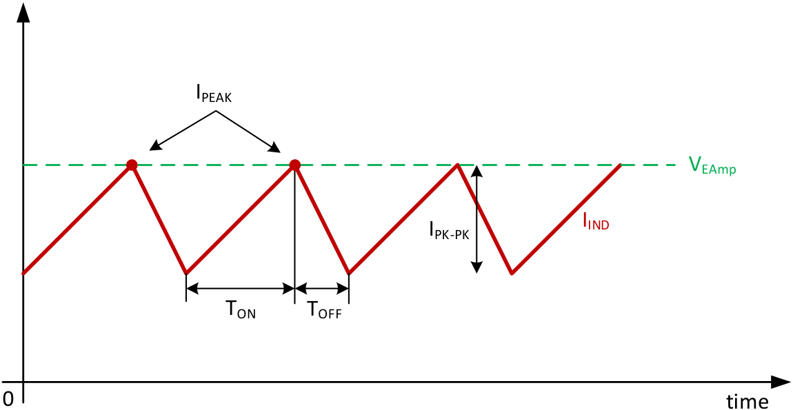

**Table 9-1. Power-Good Indicator Truth Table** 

#### **9.4 Device Functional Modes** 

##### **9.4.1 Peak-Current Mode Architecture** 

The TPS63802 is based on a peak-current mode architecture. The error amplifier provides a peak-current target (voltage that is translated into an equivalent current, see Figure 9-1), based on the current demand from the voltage loop. This target is compared to the actual inductor current during the ON-time. The ON-time is ended once the inductor current is equal to the current target and OFF-time is initiated. The OFF-time is calculated by the control and a function of VI and VO. 

<!-- Start of picture text -->
IPEAK VEAmp IPK-PK IIND TON TOFF 0 time <!-- End of picture text -->

**Figure 9-5. Peak-Current Architecture Operation** 

##### **_9.4.1.1 Reverse Current Operation, Negative Current_** 

When the TPS63802 is forced to PWM operation (MODE = HIGH), the device current can flow in reverse direction. This happens by the negative current capability of the TPS63802 . The error amplifier provides a peakcurrent target (voltage that is translated into an equivalent current, see Figure 9-1), even if the target has a negative value. The maximum average current is even more negative than the peak current.

## Structured tables

- [www.ti.comSLVSEU9D – NOVEMBER 2018 – REVISED JANUARY 2021 Table 9-1. Power-Good Indicator Truth Table](../tables/page-13-www-ti-comslvseu9d-november-2018-revised-january-2021-table-9-1-power-good-indic.yaml)
