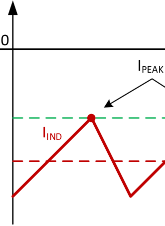
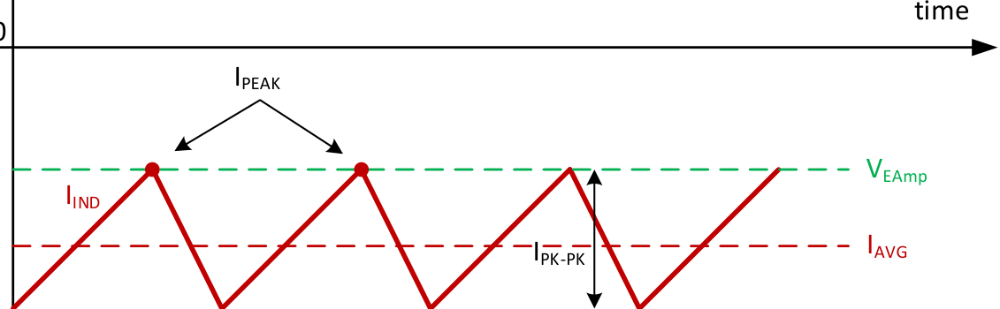
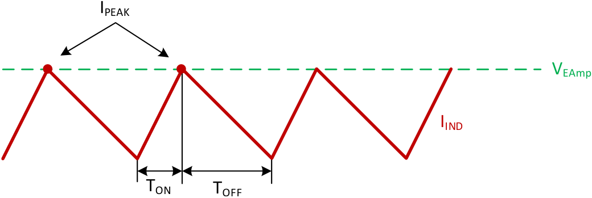

<!-- Start of picture text -->
0 IPEAKPEAK IINDIND <!-- End of picture text -->

<!-- Start of picture text -->
time IPEAKPEAK VEAmp IINDIND I PK-PK IAVG <!-- End of picture text -->

**Figure 9-6. Peak-Current Operation, Reverse Current** 

##### **_9.4.1.2 Boost Operation_** 

When VI is smaller than VO (and the voltages are not close enough to trigger buck-boost operation), the TPS63802 operates in boost mode where the boost high-side and low-side switches are active. The buck highside switch is always turned on and the buck low-side switch is always turned off. This lets the TPS63802 operate as a classical boost converter. 

<!-- Start of picture text -->
IPEAK VEAmp IIND TON TOFF <!-- End of picture text -->

**Figure 9-7. Peak-Current Boost Operation** 

##### **_9.4.1.3 Buck-Boost Operation_** 

When VI is close to VO, the TPS63802 operates in buck-boost mode where all switches are active and the device repeats 3-cycles: 

- TON: Boost-charge phase where boost low-side and buck high-side are closed and the inductor current is built up 

- TOFF: Buck discharge phase where boost high-side and buck low-side are closed and the inductor is discharged 

- TCOM: VI connected to VO where all high-side switches are closed and the input is connected to the output 

