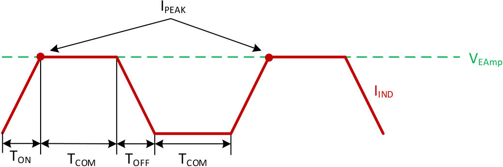
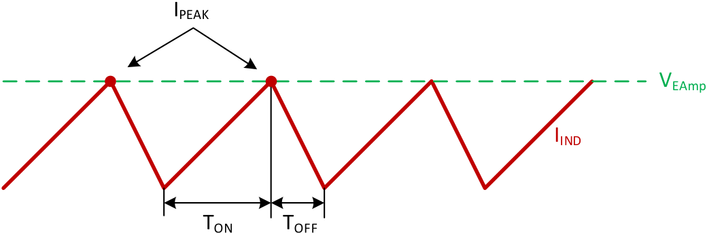

<!-- Start of picture text -->
IPEAK VEAmp IIND TON TCOM TOFF TCOM <!-- End of picture text -->

**Figure 9-8. Peak-Current Buck-Boost Operation** 

##### **_9.4.1.4 Buck Operation_** 

When VI is greater than VO (and the voltages are not close enough to trigger buck-boost operation), the TPS63802 operates in buck mode where the buck high-side and low-side switches are active. The boost highside switch is always turned on and the boost low-side switch is always turned off. This lets the TPS63802 operate as a classical buck converter. 

<!-- Start of picture text -->
IPEAK VEAmp IIND TON TOFF <!-- End of picture text -->

**Figure 9-9. Peak-Current Buck Operation** 

##### **9.4.2 Power Save Mode Operation** 

Besides continuos conduction mode (PWM), the TPS63802 features power safe mode (PFM) operation to achieve high efficiency at light load currents. This is implemented by pausing the switching operation, depending on the load current. 

The skip comparator manages the switching or pause operation. It compares the current demand signal from the voltage loop, IREF, with the skip threshold, ISKIP, as shown in Figure 9-1. If the current demand is lower than the skip value, the comparator pauses switching operation. If the current demand goes higher (due to falling VO), the comparator activates the current loop and allows switching according to the loop behavior. Whenever the current loop has risen VO by bringing charge to the output, the voltage loop output, IREF (respectively VEA), decreases. When IREF falls below ISKIP-hysteresis, it automatically pauses again. 

