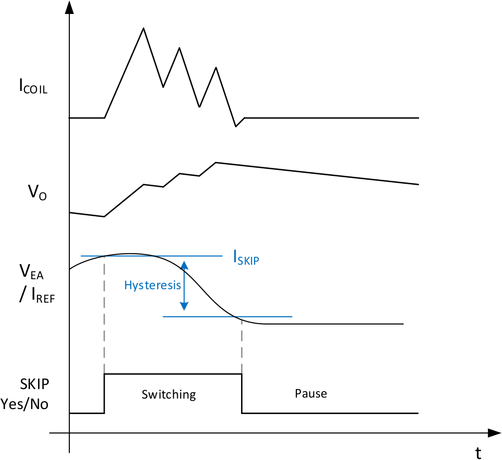

<!-- Start of picture text -->
ICOIL VO ISKIP VEA Hysteresis / IREF SKIP Switching Pause Yes/No t <!-- End of picture text -->

**Figure 9-10. Power Safe Mode Operation Curves** 

##### **_9.4.2.1 Current Limit Operation_** 

To limit current and protect the device and application, the maximum peak inductor current is limited internally on the IC. It is measured at the buck high-side switch which turns into an input current detection. To provide a certain load current across all operation modes, the boost and buck-boost peak current limit is higher than in buck mode. It limits the input current and allows no further increase of the delivered current. When using the device in this mode, it behaves similar to a current source. 

The current limit depends on the operation mode (buck, buck-boost, or boost mode). 

