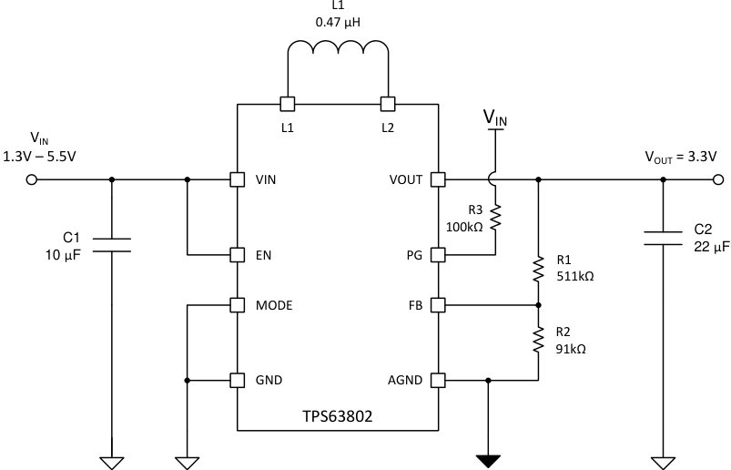

### **10 Application and Implementation** 

##### **Note** 

Information in the following applications sections is not part of the TI component specification, and TI does not warrant its accuracy or completeness. TI’s customers are responsible for determining suitability of components for their purposes, as well as validating and testing their design implementation to confirm system functionality. 

#### **10.1 Application Information** 

The TPS63802 is a high efficiency, low quiescent current, non-inverting buck-boost converter, suitable for applications that need a regulated output voltage from an input supply that can be higher or lower than the output voltage. 

#### **10.2 Typical Application** 

<!-- Start of picture text -->
L1 0.47 µH L1 L2 VIN VIN 1.3V t 5.5V VOUT = 3.3V VIN VOUT R3 100lQ C2 C1 10 …F EN PG R1 22 …F 511lQ MODE FB R2 91lQ GND AGND TPS63802 <!-- End of picture text -->

**Figure 10-1. 3.3 VOUT Typical Application** 

##### **10.2.1 Design Requirements** 

The design guideline provides a component selection to operate the device within _Table 10-1_ . 

Table 10-1 shows the list of components for the application characteristic curves. 

**Table 10-1. Matrix of Output Capacitor and Inductor Combinations** 

(1) Inductor tolerance and current derating is anticipated. The effective inductance can vary by 20% and –30%. 

(2) Capacitance tolerance and DC bias voltage derating is anticipated. The effective capacitance can vary by 20% and –50%. 

(3) TPS63802 typical application. Other check marks indicate possible filter combinations. 

##### **10.2.2 Detailed Design Procedure** 

The first step is the selection of the output filter components. To simplify this process, _Section 8.1_ outlines minimum and maximum values for inductance and capacitance. Take tolerance and derating into account when selecting nominal inductance and capacitance. 

##### **_10.2.2.1 Custom Design With WEBENCH® Tools_** 

Click here to create a custom design using the TPS63802 device with the WEBENCH® Power Designer.

## Structured tables

- [Table 10-1 shows the list of components for the application characteristic curves. Table 10-1. Matrix of Output Capacitor and Inductor Combinations](../tables/page-17-table-10-1-shows-the-list-of-components-for-the-application-characteristic-curve.yaml)
