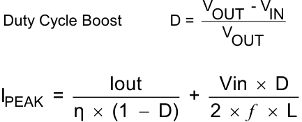
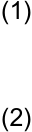

1. Start by entering the input voltage (VIN), output voltage (VOUT), and output current (IOUT) requirements. 

2. Optimize the design for key parameters such as efficiency, footprint, and cost using the optimizer dial. 

3. Compare the generated design with other possible solutions from Texas Instruments. 

The WEBENCH Power Designer provides a customized schematic along with a list of materials with real-time pricing and component availability. 

In most cases, these actions are available: 

- Run electrical simulations to see important waveforms and circuit performance 

- Run thermal simulations to understand board thermal performance 

- Export customized schematic and layout into popular CAD formats 

- Print PDF reports for the design, and share the design with colleagues 

Get more information about WEBENCH tools at www.ti.com/WEBENCH. 

##### **_10.2.2.2 Inductor Selection_** 

The inductor selection is affected by several parameters such as the following: 

- Inductor ripple current 

- Output voltage ripple 

- Transition point into power save mode 

- Efficiency 

See Table 10-2 for typical inductors. 

For high efficiencies, the inductor must have a low DC resistance to minimize conduction losses. Especially at high-switching frequencies, the core material has a high impact on efficiency. When using small chip inductors, the efficiency is reduced, mainly due to higher inductor core losses. This needs to be considered when selecting the appropriate inductor. The inductor value determines the inductor ripple current. The larger the inductor value, the smaller the inductor ripple current and the lower the conduction losses of the converter. Conversely, larger inductor values cause a slower load transient response. To avoid saturation of the inductor, the peak current for the inductor in steady-state operation is calculated using Equation 2. Only the equation which defines the switch current in boost mode is shown because this provides the highest value of current and represents the critical current value for selecting the right inductor. 

##### where 

- D = Duty Cycle in Boost mode 

- _f_ = Converter switching frequency 

- L = Inductor value 

- η = Estimated converter efficiency (use the number from the efficiency curves or 0.9 as an assumption) 

##### **Note** 

The calculation must be done for the minimum input voltage in boost mode. 

Calculating the maximum inductor current using the actual operating conditions gives the minimum saturation current of the inductor needed. It is recommended to choose an inductor with a saturation current 20% higher than the value calculated using Equation 2. Table 10-2 lists the possible inductors. 

