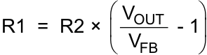

**Table 10-2. List of Recommended Inductors** 

(1) See _Third-party Products Disclaimer_ . 

##### **_10.2.2.3 Output Capacitor Selection_** 

For the output capacitor, it is recommended to use small ceramic capacitors placed as close as possible to the VOUT and PGND pins of the IC. The recommended nominal output capacitor value is a single 22 µF for all programmed output voltages ≤ 3.6 V. Above that voltage, 2x 22 µF capacitors are recommended. 

It is important that the effective capacitance is given according to the recommended value in _Section 8.3_ . In general, consider DC bias effects resulting in less effective capacitance. The choice of the output capacitance is mainly a trade-off between size and transient behavior since higher capacitance reduces transient response overshoot and undershoot and increases transient response time. Table 10-3 lists possible output capacitors. 

There is no upper limit for the output capacitance value. 

**Table 10-3. List of Recommended Capacitors****(1)** 

(1) See _Third-party Products Disclaimer_ . 

##### **_10.2.2.4 Input Capacitor Selection_** 

A 10 µF input capacitor is recommended to improve line transient behavior of the regulator and EMI behavior of the total power supply circuit. An X5R or X7R ceramic capacitor placed as close as possible to the VIN and PGND pins of the IC is recommended. This capacitance can be increased without limit. If the input supply is located more than a few inches from the TPS63802 converter, additional bulk capacitance can be required in addition to the ceramic bypass capacitors. An electrolytic or tantalum capacitor with a value of 47 µF is a typical choice. 

**Table 10-4. List of Recommended Capacitors****(1)** 

##### **_10.2.2.5 Setting The Output Voltage_** 

The output voltage is set by an external resistor divider. The resistor divider must be connected between VOUT, FB, and GND. The feedback voltage is 500 mV nominal. The low-side resistor R2 (between FB and GND) must not exceed 100 kΩ. The high-side resistor (between FB and VOUT) R1 is calculated by Equation 3. 

## Structured tables

- [www.ti.comSLVSEU9D – NOVEMBER 2018 – REVISED JANUARY 2021 Table 10-2. List of Recommended Inductors](../tables/page-19-www-ti-comslvseu9d-november-2018-revised-january-2021-table-10-2-list-of-recomme.yaml)
- [There is no upper limit for the output capacitance value. Table 10-3. List of Recommended Capacitors (1)](../tables/page-19-there-is-no-upper-limit-for-the-output-capacitance-value-table-10-3-list-of-reco.yaml)
- [choice. Table 10-4. List of Recommended Capacitors (1)](../tables/page-19-choice-table-10-4-list-of-recommended-capacitors-1.yaml)
