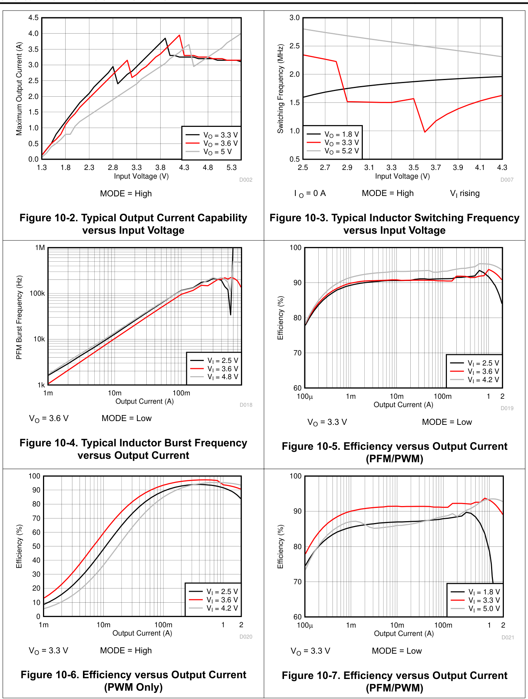

###### **TPS63802** 

###### SLVSEU9D – NOVEMBER 2018 – REVISED JANUARY 2021 

<!-- Start of picture text -->
www.ti.com <!-- End of picture text -->

<!-- Start of picture text -->
4.5 3.0 4.0 3.5 2.5 3.0 2.0 2.5 2.0 1.5 1.5 1.0 VO = 3.3 V 1.0 VO = 1.8 V 0.5 V O  = 3.6 V VO = 3.3 V VO = 5 V VO = 5.2 V 0.0 0.5 1.3 1.8 2.3 2.8 3.3 3.8 4.3 4.8 5.3 2.5 2.7 2.9 3.1 3.3 3.5 3.7 3.9 4.1 4.3 Input Voltage (V) D002 Input Voltage (V) D007 MODE = High I O = 0 A MODE = High VI rising Figure 10-2. Typical Output Current Capability Figure 10-3. Typical Inductor Switching Frequency versus Input Voltage versus Input Voltage 1M 100 90 100k 80 10k 70 V I  = 2.5 V VI = 2.5 V 1k VV I I = 3.6 V = 4.8 V 60 VVII = 3.6 V = 4.2 V 1m 10mOutput Current (A)100m D018 100P 1m Output Current (A)10m 100m 1 2D019 VO = 3.6 V MODE = Low VO = 3.3 V MODE = Low Figure 10-4. Typical Inductor Burst Frequency Figure 10-5. Efficiency versus Output Current versus Output Current (PFM/PWM) 100 100 90 80 90 70 60 50 80 40 30 70 20 VI = 2.5 V VI = 1.8 V 10 V I  = 3.6 V VI = 3.3 V VI = 4.2 V VI = 5.0 V 0 60 1m 10m 100m 1 2 100P 1m 10m 100m 1 2 Output Current (A) D020 Output Current (A) D021 VO = 3.3 V MODE = High VO = 3.3 V MODE = Low Figure 10-6. Efficiency versus Output Current Figure 10-7. Efficiency versus Output Current (PWM Only) (PFM/PWM) Maximum Output Current (A) Switching Frequency (MHz) Efficiency (%) PFM Burst Frequency (Hz) Efficiency (%) Efficiency (%) <!-- End of picture text -->

