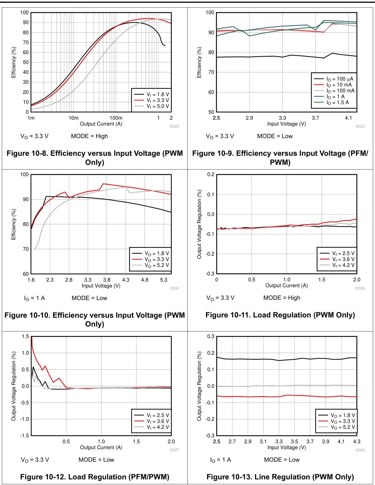

**www.ti.com** 

<!-- Start of picture text -->
100 100 90 80 90 70 60 80 50 40 70 30 IO = 100 PA IO = 10 mA 2010 VVVI I I = 1.8 V = 3.3 V = 5.0 V 60 I II O OO  = 100 mA  = 1 A = 1.5 A 0 50 1m 10m 100m 1 2 2.5 2.9 3.3 3.7 4.1 Output Current (A) D022 Input Voltage (V) D023 VO = 3.3 V MODE = High VO = 3.3 V MODE = Low Figure 10-8. Efficiency versus Input Voltage (PWM Figure 10-9. Efficiency versus Input Voltage (PFM/ Only) PWM) 100 0.2 0.1 90 0.0 80 -0.1 70 VO = 1.8 V -0.2 VI = 2.5 V VO = 3.3 V VI = 3.6 V VO = 5.2 V VI = 4.2 V 60 -0.3 1.8 2.3 2.8 3.3 3.8 4.3 4.8 5.3 0 0.5 1.0 1.5 2.0 Input Voltage (V) D024 Output Current (A) D026 IO = 1 A MODE = Low VO = 3.3 V MODE = High Figure 10-10. Efficiency versus Input Voltage (PWM Figure 10-11. Load Regulation (PWM Only) Only) 1.5 0.3 1.0 0.2 0.5 0.1 0.0 0.0 -0.5 -0.1 -1.0 VVII = 2.5 V = 3.6 V -0.2 VVOO = 1.8 V = 3.3 V VI = 4.2 V VO = 5.2 V -1.5 -0.3 0.5 1.0 1.5 2.0 2.5 2.7 2.9 3.1 3.3 3.5 3.7 3.9 4.1 4.3 Output Current (A) D027 Input Voltage (V) D028 VO = 3.3 V MODE = Low IO = 1 A MODE = Low Figure 10-12. Load Regulation (PFM/PWM) Figure 10-13. Line Regulation (PWM Only) Efficiency (%) Efficiency (%) Efficiency (%) Output Voltage Regulation (%) Output Voltage Regulation (%) Output Voltage Regulation (%) <!-- End of picture text -->

