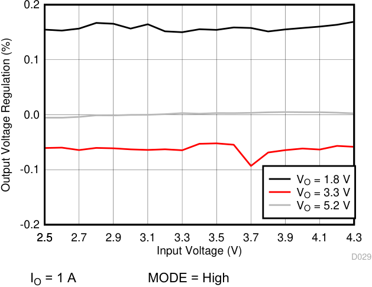
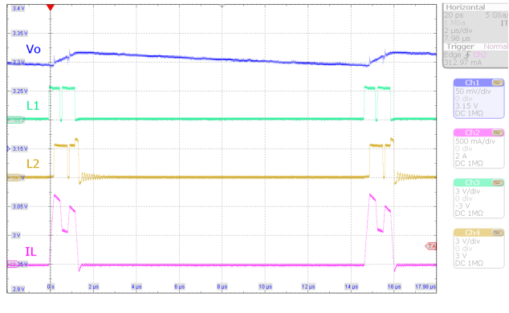
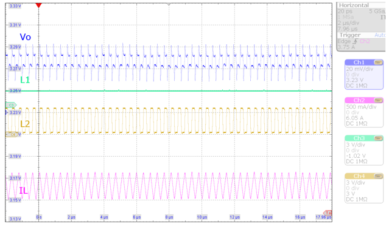
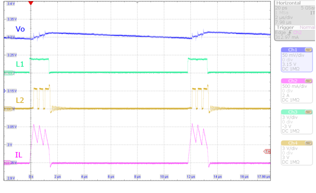
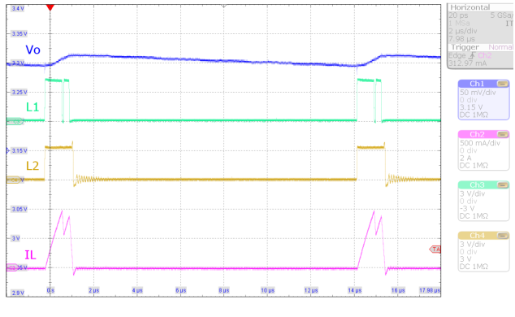
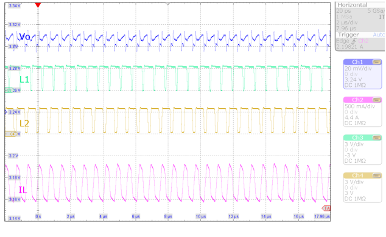

###### **TPS63802** 

###### SLVSEU9D – NOVEMBER 2018 – REVISED JANUARY 2021 

<!-- Start of picture text -->
0.2 0.1 0.0 -0.1 VO = 1.8 V VO = 3.3 V VO = 5.2 V -0.2 2.5 2.7 2.9 3.1 3.3 3.5 3.7 3.9 4.1 4.3 Input Voltage (V) D029 IO = 1 A MODE = High Output Voltage Regulation (%) <!-- End of picture text -->

**Figure 10-14. Line Regulation (PFM/PWM)** 

**Figure 10-16. Switching Waveforms, PFM BuckBoost Operation** 

<!-- Start of picture text -->
Figure 10-18. Switching Waveforms, PWM Boost Operation <!-- End of picture text -->

**Figure 10-15. Switching Waveforms, PFM Boost Operation** 

**Figure 10-17. Switching Waveforms, PFM Buck Operation** 

<!-- Start of picture text -->
Figure 10-19. Switching Waveforms, PWM Buck- Boost Operation <!-- End of picture text -->

