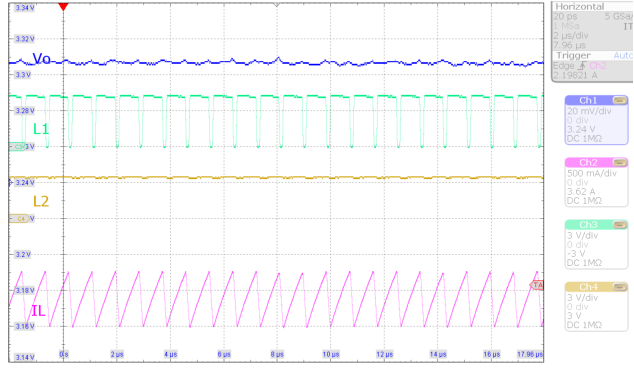
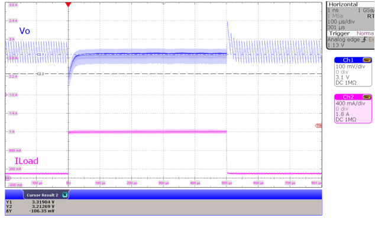
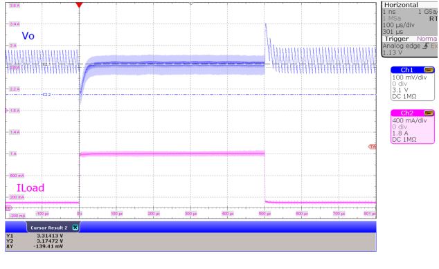
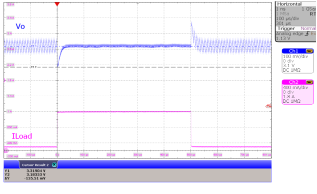
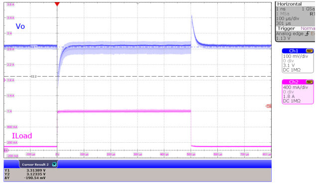

###### **www.ti.com** 

VI = 4.2 V, VO = 3.3 V MODE = Low IO = 2 A 

**Figure 10-20. Switching Waveforms, PWM Buck Operation** 

IO from 100 mA to VI = 3.3 V, VO = 3.3 V 1 A tr = 1 µs, tf = MODE = Low 1 µs 

**Figure 10-22. Load Transient, PFM/PWM BuckBoost Operation** 

IO from 100 mA to VI = 2.5 V, VO = 3.3 V 1 A tr = 1 µs, tf = MODE = High 1 µs 

**Figure 10-24. Load Transient, PWM Boost Operation** 

VI = 2.5 V, VV O = 3.3 1 A tIO from 100 mA tor = 1 µs, tf = 1 MODE = Low µs 

**Figure 10-21. Load Transient, PFM/PWM Boost Operation** 

IO from 100 mA to VI = 5 V, VO = 3.3 V 1 A tr = 1 µs, tf = MODE = Low 1 µs 

**Figure 10-23. Load Transient, PFM/PWM Buck Operation** 

IO from 100 mA to VI = 3.3 V, VO = 3.3 V 1 A tr = 1 µs, tf = MODE = High 1 µs 

**Figure 10-25. Load Transient, PWM Buck-Boost Operation** 

