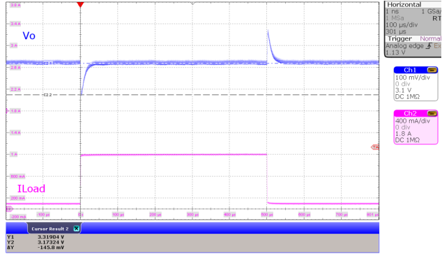
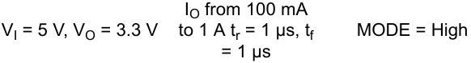
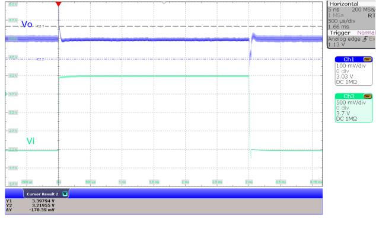
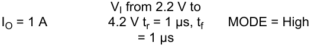
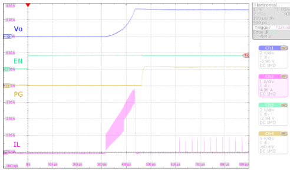
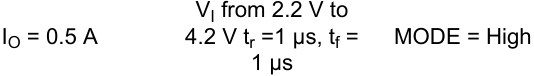
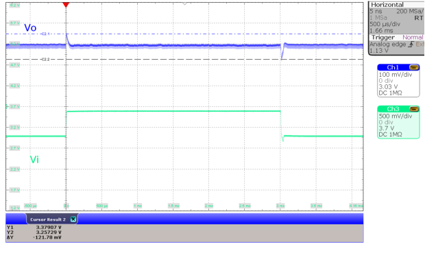
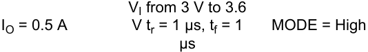
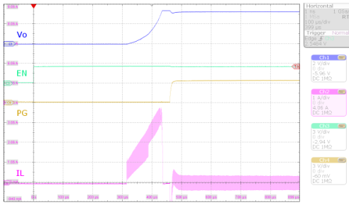

###### **TPS63802** 

###### SLVSEU9D – NOVEMBER 2018 – REVISED JANUARY 2021 

<!-- Start of picture text -->
IO from 100 mA VI = 5 V, VO = 3.3 V to 1 A tr = 1 µs, tf MODE = High = 1 µs <!-- End of picture text -->

**Figure 10-26. Load Transient, PWM Buck Operation** 

<!-- Start of picture text -->
VI from 2.2 V to IO = 1 A 4.2 V tr = 1 µs, tf MODE = High = 1 µs <!-- End of picture text -->

**Figure 10-28. Line Transient, PWM Operation** 

**Figure 10-30. Start-up Behavior from Rising Enable, PFM Operation** 

<!-- Start of picture text -->
VI from 2.2 V to IO = 0.5 A 4.2 V tr =1 µs, tf = MODE = High 1 µs <!-- End of picture text -->

**Figure 10-27. Line Transient, PWM Operation** 

<!-- Start of picture text -->
VI from 3 V to 3.6 IO = 0.5 A V tr = 1 µs, tf = 1 MODE = High µs <!-- End of picture text -->

**Figure 10-29. Line Transient, PWM Operation** 

**Figure 10-31. Start-up Behavior from Rising Enable, PWM Operation** 

