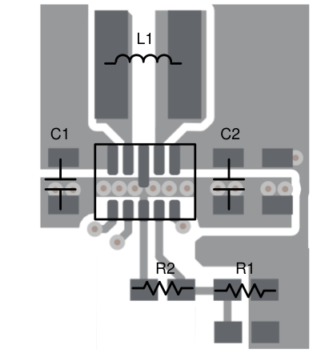

### **12 Layout** 

#### **12.1 Layout Guidelines** 

The PCB layout is an important step to maintain the high performance of the TPS63802 device. 

1. Place input and output capacitors as close as possible to the IC. Traces need to be kept short. Route wide and direct traces to the input and output capacitor results in low trace resistance and low parasitic inductance. 

2. Use a common ground node for power ground and a different one for control ground to minimize the effects of ground noise. Connect these ground nodes at any place close to one of the ground pins of the IC. 

3. Use separate traces for the supply voltage of the power stage and the supply voltage of the analog stage. 

4. The sense trace connected to FB is signal trace. Keep these traces away from L1 and L2 nodes. 

#### **12.2 Layout Example** 

<!-- Start of picture text -->
L1 C1 C2 R2 R1 <!-- End of picture text -->

**Figure 12-1. TPS63802 Layout** 

