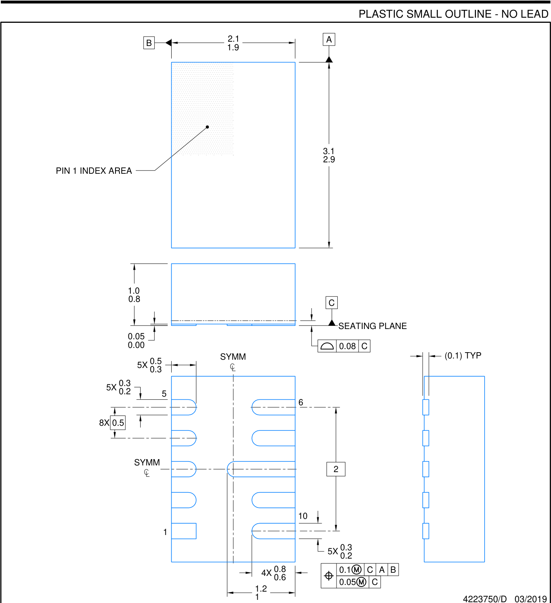

<!-- Start of picture text -->
PLASTIC SMALL OUTLINE - NO LEAD 2.1 A B 1.9 3.1 2.9 PIN 1 INDEX AREA 1.0 0.8 C SEATING PLANE 0.05 0.00 0.08 C SYMM (0.1) TYP 5X  0.5 0.3 5X  0.3 0.2 5 6 8X 0.5 SYMM 2 10 1 5X  0.3 0.2 4X  0.8 0.1 C A B 0.6 0.05 C 1.2 1 4223750/D   03/2019 <!-- End of picture text -->

NOTES: 

1. All linear dimensions are in millimeters. Any dimensions in parenthesis are for reference only. Dimensioning and tolerancing per ASME Y14.5M. 

2. This drawing is subject to change without notice. 

