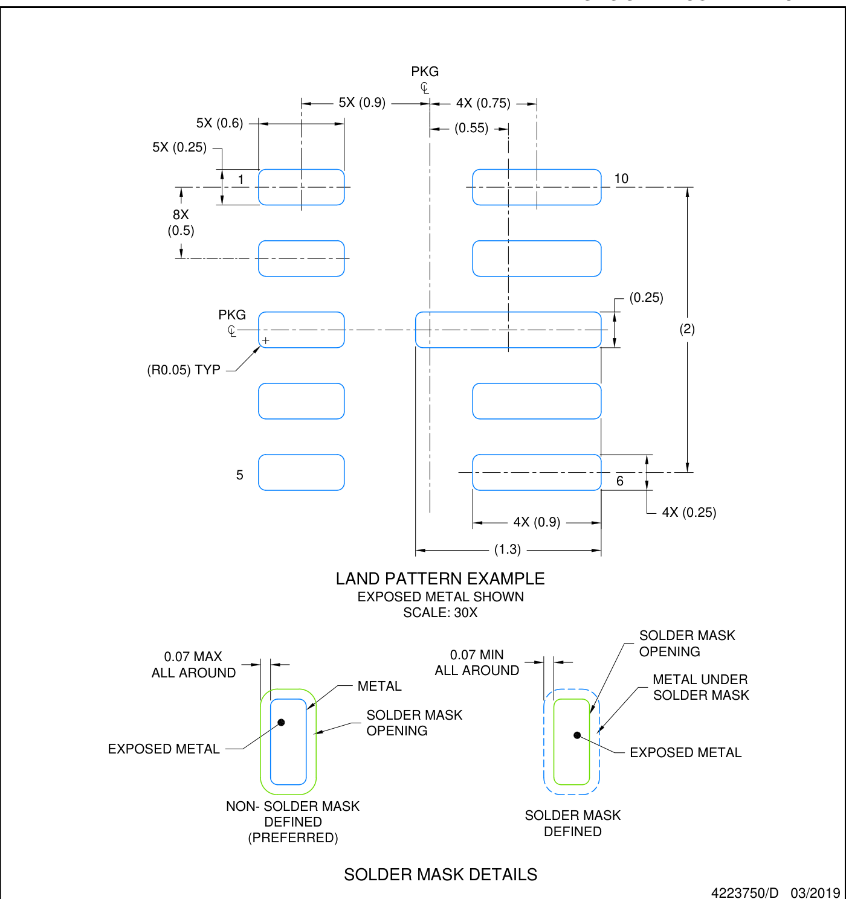

##### PLASTIC SMALL OUTLINE - NO LEAD 

<!-- Start of picture text -->
PKG 5X (0.9) 4X (0.75) 5X (0.6) (0.55) 5X (0.25) 1 10 8X (0.5) (0.25) PKG (2) (R0.05) TYP 5 6 4X (0.25) 4X (0.9) (1.3) LAND PATTERN EXAMPLE EXPOSED METAL SHOWN SCALE: 30X SOLDER MASK 0.07 MAX 0.07 MIN OPENING ALL AROUND ALL AROUND METAL UNDER METAL SOLDER MASK SOLDER MASK OPENING EXPOSED METAL EXPOSED METAL NON- SOLDER MASK SOLDER MASK DEFINED DEFINED (PREFERRED) SOLDER MASK DETAILS 4223750/D   03/2019 <!-- End of picture text -->

NOTES: (continued) 

3. For more information, see Texas Instruments literature number SLUA271 (www.ti.com/lit/slua271). 

4. Solder mask tolerances between and around signal pads can vary based on board fabrication site. 

