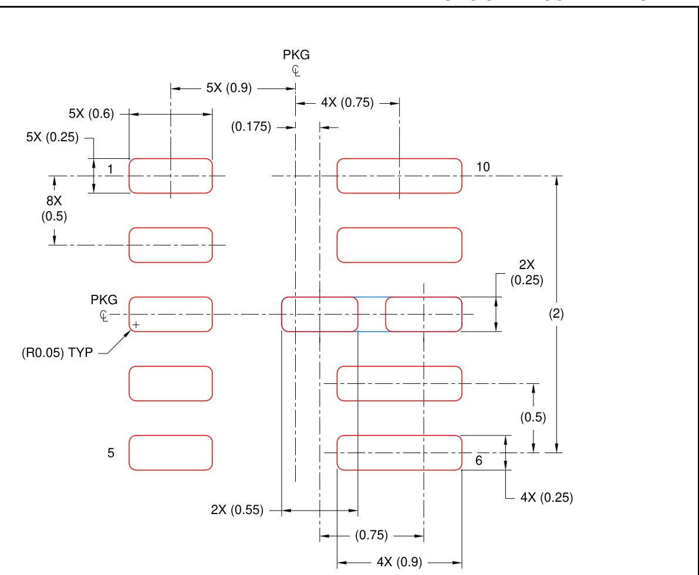

##### PLASTIC SMALL OUTLINE - NO LEAD 

<!-- Start of picture text -->
PKG 5X (0.9) 4X (0.75) 5X (0.6) (0.175) 5X (0.25) 1 10 8X (0.5) 2X (0.25) PKG (2) (R0.05) TYP (0.5) 5 6 4X (0.25) 2X (0.55) (0.75) 4X (0.9) <!-- End of picture text -->

<!-- Start of picture text -->
SOLDER PASTE EXAMPLE BASED ON 0.1 mm THICK STENCIL PRINTED SOLDER COVERAGE BY AREA UNDER PACKAGE PAD 8: 83% SCALE: 30X <!-- End of picture text -->

<!-- Start of picture text -->
4223750/D   03/2019 <!-- End of picture text -->

NOTES: (continued) 

5. Laser cutting apertures with trapezoidal walls and rounded corners may offer better paste release. IPC-7525 may have alternate design recommendations. 

