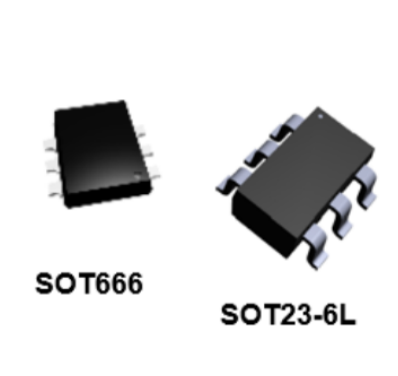
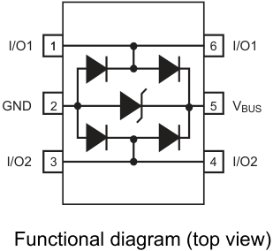

# Very low capacitance ESD protection 

<!-- Start of picture text -->
I/O1 1 6 I/O1 GND 2 5 VBUS I/O2 3 4 I/O2 Functional diagram (top view) <!-- End of picture text -->

## **Features** 

- 2 data-line protection 

- Protects VBUS 

- Very low capacitance: 3.5 pF max. 

- Very low leakage current: 150 nA max. 

- SOT-666 and SOT23-6L packages 

- RoHS compliant 

#### **Benefits** 

- Very low capacitance between lines to GND for optimized data integrity and speed 

- Low PCB space consumption: 2.9 mm² max for SOT-666 and 9 mm² max for SOT23-6L 

- Enhanced ESD protection: IEC 61000-4-2 level 4 compliance guaranteed at device level, hence greater immunity at system level 

- ESD protection of VBUS 

- High reliability offered by monolithic integration 

- Low leakage current for longer operation of battery powered devices 

- • Fast response time 

- Consistent D+ / D- signal balance: 

   - Very low capacitance matching tolerance I/O to GND = 0.015 pF 

   - Compliant with USB 2.0 requirements 

#### **Complies with the following standards:** 

- IEC 61000-4-2 level 4: 

   - 15 kV (air discharge) 

   - 8 kV (contact discharge) 

##### **Product status link** 

## **Applications** 

USBLC6-2 

- USB 2.0 ports up to 480 Mb/s (high speed) 

- Compatible with USB 1.1 low and full speed 

- Ethernet port: 10/100 Mb/s 

- SIM card protection 

- Video line protection 

- Portable electronics 

## **Description** 

The USBLC6-2SC6 and USBLC6-2P6 are monolithic application specific devices dedicated to ESD protection of high speed interfaces, such as USB 2.0, Ethernet links and video lines. 

The very low line capacitance secures a high level of signal integrity without compromising in protecting sensitive chips against the most stringently characterized ESD strikes. 

