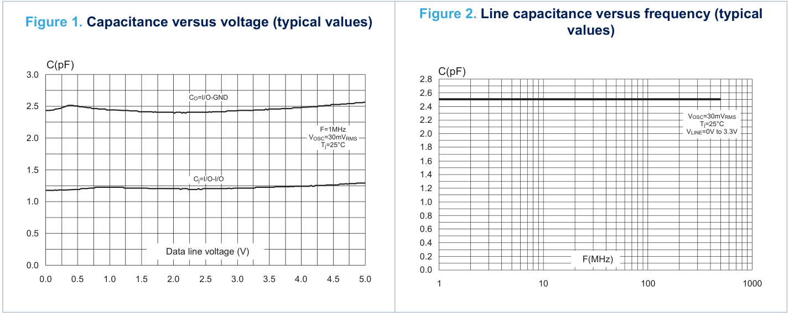
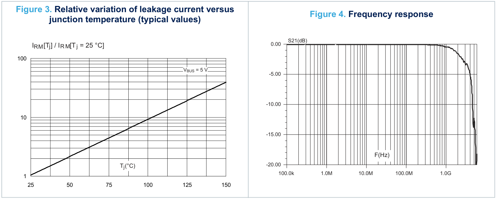

## **1.1 Characteristics (curves)** 

<!-- Start of picture text -->
Figure 2. Line capacitance versus frequency (typical Figure 1. Capacitance versus voltage (typical values) values) C(pF) 3.0 C(pF) 2.8 C O =I/O-GND 2.6 2.5 2.4 2.0 VOSCF=1MHz=30mVRMS 2.22.0 VVLINEOSCT =25°C=0V to 3.3V=30mVj RMS T =25°Cj 1.8 1.6 1.5 C =I/O-I/O j 1.4 1.2 1.0 1.0 0.8 0.5 0.6 0.4 0.0 Data line voltage (V) 0.2 F(MHz) 0.0 0.0 0.5 1.0 1.5 2.0 2.5 3.0 3.5 4.0 4.5 5.0 1 10 100 1000 <!-- End of picture text -->

<!-- Start of picture text -->
Figure 3. Relative variation of leakage current versus Figure 4. Frequency response junction temperature (typical values) IRM [Tj ] / I R M[T j  = 25 °C] 0.00 S21(dB) 100 VBUS  = 5 V -5.00 -10.00 10 -15.00 F(Hz) T (°C)j -20.00 100.0k 1.0M 10.0M 100.0M 1.0G 1 25 50 75 100 125 150 <!-- End of picture text -->

