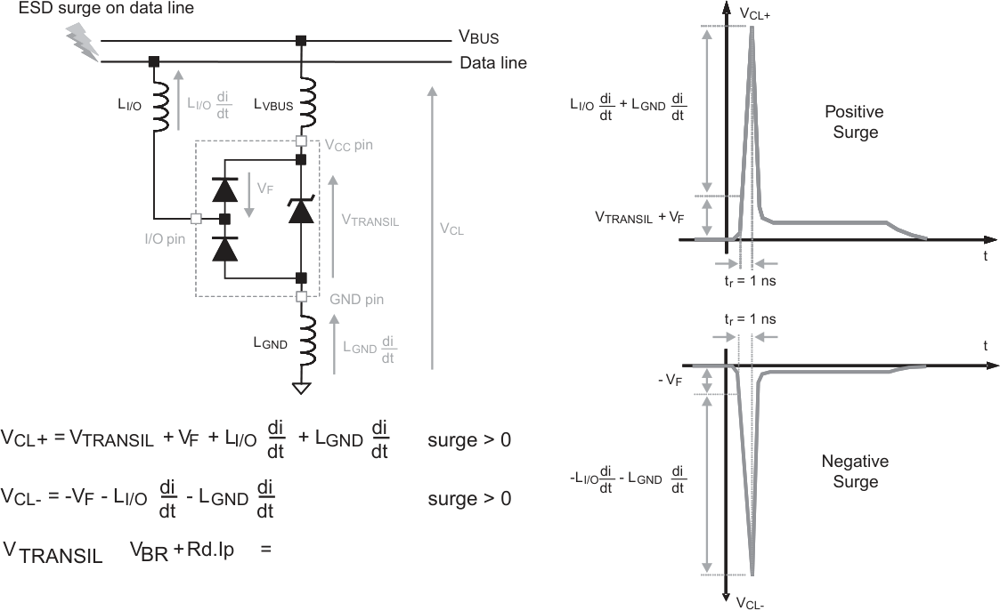

**Figure 5. ESD behavior: parasitic phenomena due to unsuitable layout** 

<!-- Start of picture text -->
ESD surge on data line VCL+ VBUS Data line LI/O LI/O dtdi LVBUS LI/O dtdi + LGND dtdi Positive Surge VCC pin VF I/O pin VTRANSIL VCL VTRANSIL + VF t tr = 1 ns GND pin tr = 1 ns LGND LGND dtdi t - VF di di VCL+  = V TRANSIL + VF + LI/O + LGND surge > 0 dt dt di di -LI/Odtdi - LGND dtdi NegativeSurge VCL- = -VF - LI/O - LGND surge > 0 dt dt V TRANSIL VBR + Rd.Ip = VCL- <!-- End of picture text -->

