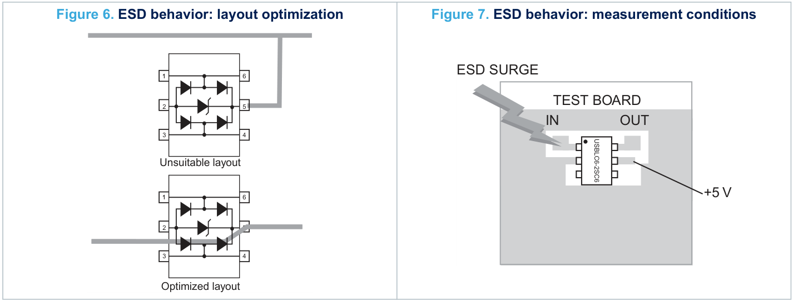
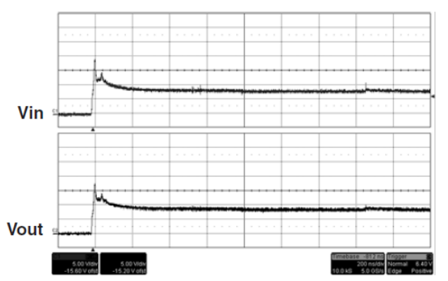
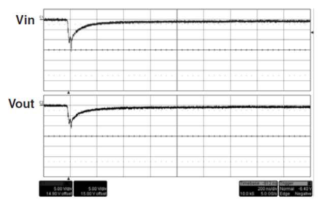

## **2.3 How to ensure good ESD protection** 

While the USBLC6-2 provides high immunity to ESD surge, efficient protection depends on the layout of the board. In the same way, with the rail to rail topology, the track from data lines to I/O pins, from VCC to VBUS pin and from GND plane to GND pin must be as short as possible to avoid overvoltages due to parasitic phenomena (see Figure 6. ESD behavior: layout optimization and Figure 5. ESD behavior: parasitic phenomena due to unsuitable layout for layout consideration). 

<!-- Start of picture text -->
Figure 6. ESD behavior: layout optimization Figure 7. ESD behavior: measurement conditions 1 6 ESD SURGE 2 5 TEST BOARD IN OUT 3 4 Unsuitable layout 1 6 +5 V 2 5 3 4 Optimized layout USBLC6-2SC6 <!-- End of picture text -->

**Figure 8. ESD response to IEC 61000-4-2 (+15 kV air discharge)** 

**Figure 9. ESD response to IEC 61000-4-2 (-15 kV air discharge)** 

_Note:_ **_Important_** _: A good precaution to take is to put the protection device as close as possible to the disturbance source (generally the connector)._ 

