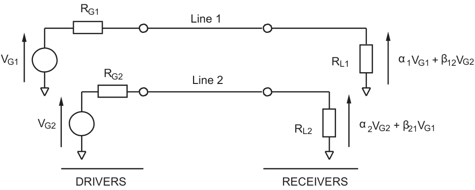
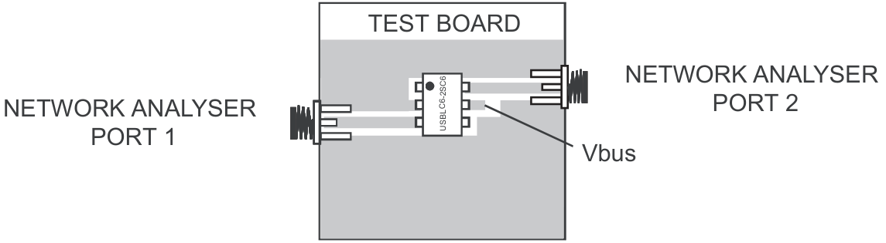

## **2.4 Crosstalk behavior** 

### **2.4.1 Crosstalk phenomenon** 

#### **Figure 10. Crosstalk phenomenon** 

<!-- Start of picture text -->
RG1 Line 1 VG1 RL1 α 1VG1 + β12VG2 RG2 Line 2 VG2 RL2 α 2VG2 + β21VG1 DRIVERS RECEIVERS <!-- End of picture text -->

The crosstalk phenomenon is due to the coupling between 2 lines. The coupling factor (β12 or β21) increases when the gap across lines decreases, particularly in silicon dice. In the above example the expected signal on load RL2 is α2VG2, in fact the real voltage at this point has got an extra value β21VG1. This part of the VG1 signal represents the effect of the crosstalk phenomenon of the line 1 on the line 2. This phenomenon has to be taken into account when the drivers impose fast digital data or high frequency analog signals in the disturbing line. The perturbed line will be more affected if it works with low voltage signal or high load impedance (few kΩ). 

**Figure 11. Analog crosstalk measurements** 

<!-- Start of picture text -->
TEST BOARD NETWORK ANALYSER NETWORK ANALYSER PORT 2 PORT 1 Vbus USBLC6-2SC6 <!-- End of picture text -->

Figure 11. Analog crosstalk measurements shows the measurement circuit for the analog application. In usual frequency range of analog signals (up to 240 MHz) the effect on disturbed line is less than -55 dB (see Figure 12. Analog crosstalk results). 

